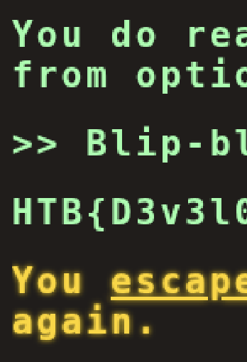

## 題目 - Flag Command
- EVENT: [CTF Try Out](https://ctf.hackthebox.com/event/1434)
- 種類: web
- 難度: very easy
- 靶機: `83.136.254.84:55301`

## 解題過程概述

訪問 `83.136.254.84:55301` 出現互動輸入筐  
view source [main.js](main.js) 發現`遊戲破關邏輯`
即可拿到 `flag`

```bash
# main.js
...
 if (availableOptions[currentStep].includes(currentCommand) || availableOptions['secret'].includes(currentCommand)) {
        await fetch('/api/monitor', {
            method: 'POST',
            headers: {
                'Content-Type': 'application/json'
            },
            body: JSON.stringify({ 'command': currentCommand })
        })
            .then((res) => res.json())
            .then(async (data) => {
                console.log(data)
                await displayLineInTerminal({ text: data.message });

                if (data.message.includes('Game over')) {
                    playerLost();
                    fetchingResponse = false;
                    return;
                }

                if (data.message.includes('HTB{')) {
                    playerWon();
                    fetchingResponse = false;

                    return;
                }
...
```

##  Initial Access - Client-Side Security Risks

### Vulnerability Explanation
此挑戰的核心漏洞是 **客戶端邏輯暴露** (Client-Side Logic Exposure)：

1. **敏感資訊洩漏**: 所有遊戲邏輯和驗證規則都儲存在前端 JavaScript 中，攻擊者可以輕易讀取
2. **隱藏功能暴露**: `availableOptions['secret']` 這個隱藏選項及其對應的命令都以明文形式存在於客戶端
3. **缺乏後端驗證**: 雖然有 `/api/monitor` 端點，但主要的邏輯判斷依賴前端程式碼

這種設計違反了「永遠不要信任客戶端」的安全原則。

### Vulnerability Fix

要修復此漏洞，建議採取以下措施：

1. **後端驗證**: 將所有遊戲邏輯和命令驗證移至後端
   ```python
   # 後端範例 (Python Flask)
   SECRET_COMMANDS = ['Bl4ckjack']  # 不暴露在前端
   
   @app.route('/api/monitor', methods=['POST'])
   def monitor():
       command = request.json.get('command')
       if command in SECRET_COMMANDS:
           return jsonify({'message': 'HTB{...}'})
       # 其他驗證邏輯
   ```

2. **混淆與加密**: 如果必須在前端存放邏輯，應進行代碼混淆
3. **最小化暴露**: 不要在前端暴露完整的遊戲流程
4. **實施速率限制**: 在 API 端點加入速率限制，防止暴力破解

### POC 

F12  在 [main.js](main.js) 在 `availableOptions` 附近下斷點  
然後在互動頁面輸入 `start` > `secert`  
斷點可以看到 `availableOptions` 內洩漏 `secert` 的內容 `Bl...ck`  
複製內容，在互動輸入筐貼上，即可獲取 `flag`

### Proof Screenshot



**Note**: 此 writeup 僅用於教育目的,請勿在未經授權的系統上進行測試。