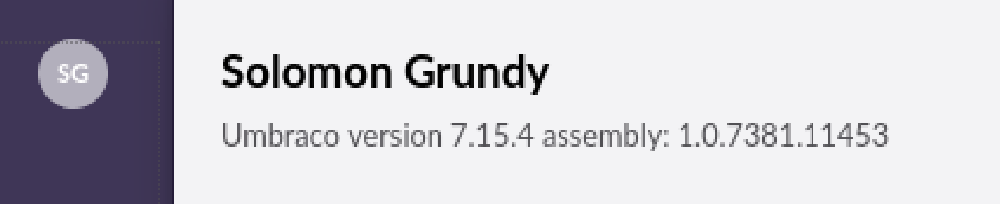

## 概述

來源: [tryhackme](https://tryhackme.com/room/anthem)  
題目: Anthem
難度: easy  
靶機: `10.10.96.104`

## enum
### nmap
有檔 ping 
```bash
┌──(kali㉿kali)-[~/tryhackme/anthem]
└─$ nmap -sV -sC -v anthem.thm   
...
Note: Host seems down. If it is really up, but blocking our ping probes, try -Pn
Nmap done: 1 IP address (0 hosts up) scanned in 3.22 seconds
           Raw packets sent: 8 (304B) | Rcvd: 0 (0B)

```
使用 `-Pn`
```bash
┌──(kali㉿kali)-[~/tryhackme/anthem]
└─$ nmap -sV -sC -v  -Pn anthem.thm
...
PORT     STATE SERVICE       VERSION
80/tcp   open  http          Microsoft HTTPAPI httpd 2.0 (SSDP/UPnP)
3389/tcp open  ms-wbt-server Microsoft Terminal Services
|_ssl-date: 2025-11-09T07:23:35+00:00; -1s from scanner time.
| ssl-cert: Subject: commonName=WIN-LU09299160F
| Issuer: commonName=WIN-LU09299160F
| Public Key type: rsa
| Public Key bits: 2048
| Signature Algorithm: sha256WithRSAEncryption
| Not valid before: 2025-11-08T07:19:58
| Not valid after:  2026-05-10T07:19:58
| MD5:   85c1:be95:1820:c042:04f6:cbd9:a1e2:8f33
|_SHA-1: 0501:04f8:74b5:2d1a:b25c:923c:dbb0:1797:9261:6975
| rdp-ntlm-info: 
|   Target_Name: WIN-LU09299160F
|   NetBIOS_Domain_Name: WIN-LU09299160F
|   NetBIOS_Computer_Name: WIN-LU09299160F
|   DNS_Domain_Name: WIN-LU09299160F
|   DNS_Computer_Name: WIN-LU09299160F
|   Product_Version: 10.0.17763
|_  System_Time: 2025-11-09T07:22:33+00:00
Service Info: OS: Windows; CPE: cpe:/o:microsoft:windows

Host script results:
|_clock-skew: mean: -1s, deviation: 0s, median: -1s
...
```

### gobuster
```bash
┌──(kali㉿kali)-[~/tryhackme/anthem]
└─$ gobuster dir -u http://anthem.thm -w /usr/share/seclists/Discovery/Web-Content/common.txt -t 50
===============================================================
Gobuster v3.6
by OJ Reeves (@TheColonial) & Christian Mehlmauer (@firefart)
===============================================================
[+] Url:                     http://anthem.thm
[+] Method:                  GET
[+] Threads:                 50
[+] Wordlist:                /usr/share/seclists/Discovery/Web-Content/common.txt
[+] Negative Status codes:   404
[+] User Agent:              gobuster/3.6
[+] Timeout:                 10s
===============================================================
Starting gobuster in directory enumeration mode
===============================================================
/Blog                 (Status: 200) [Size: 5384]
/Archive              (Status: 301) [Size: 123] [--> /blog/]
/Search               (Status: 200) [Size: 3460]
/RSS                  (Status: 200) [Size: 1865]
/SiteMap              (Status: 200) [Size: 1029]
/archive              (Status: 301) [Size: 123] [--> /blog/]
/authors              (Status: 200) [Size: 4105]
/blog                 (Status: 200) [Size: 5384]
/categories           (Status: 200) [Size: 3531]
Progress: 1124 / 4747 (23.68%)[ERROR] Get "http://anthem.thm/affiliatewiz": context deadline exceeded (Client.Timeout exceeded while awaiting headers)
/install              (Status: 302) [Size: 126] [--> /umbraco/]
...
```

### get flag 
在 blog 內  
看這個文章的 view-source 可找到每個 flag   

## initial access

### get admin name 
在 blog 文章中發現有一首詩？！  
google 後會得到一個名字 就是 administrator name  

### get admin email
然後參考靶機網站上出現的 email 格式  
可以猜到 admin 的 email

### robots.txt
取得密碼

### xfreerdp3
嘗試用剛剛的帳密 rdp 成功登入
```bash
┌──(kali㉿kali)-[~/tryhackme/anthem]
└─$ xfreerdp3 /v:anthem.thm /u:SG /p:U...! 
[16:55:39:947] [27946:00006d2c] [WARN][com.freerdp.client.x11] - [load_map_from_xkbfile]:     : keycode: 0x08 -> no RDP scancode found
...
```

### get user.txt
成功取得 flag
```bash
C:\>dir /s user.txt
 Volume in drive C has no label.
 Volume Serial Number is 1225-5238

 Directory of C:\Users\SG\Desktop

05/04/2020  22:41                14 user.txt
               1 File(s)             14 bytes
```

### Privilege Escalation

開啟資料夾管理> 開啟隱藏檔案  
發現 backup 資料夾裡面有個 restore.txt  
但沒有權限  
嘗試用 icacls 改權限

#### icacls
修改權限 
成功取得 admin 密碼
```bash
C:\backup>icacls restore.txt
restore.txt
Successfully processed 1 files; Failed processing 0 files

C:\backup>cacls restore.txt /grant %username%:F
Are you sure (Y/N)?y
processed file: C:\backup\restore.txt

C:\backup>type restore.txt
C...e
```

改用系統管理員開啟 cmd
輸入密碼 成功取得 admin user
並取得 root.txt
```bash
C:\Windows\system32>whoami
win-lu09299160f\administrator

C:\Windows\system32>dir C:\Users\Administrator\Desktop
 Volume in drive C has no label.
 Volume Serial Number is 1225-5238

 Directory of C:\Users\Administrator\Desktop

03/01/2021  17:49    <DIR>          .
03/01/2021  17:49    <DIR>          ..
05/04/2020  10:54                17 root.txt
               1 File(s)             17 bytes
               2 Dir(s)  42,856,501,248 bytes free

C:\Windows\system32>type C:\Users\Administrator\Desktop\root.txt
THM{...}
```


## 補充
### umbraco login 

訪問以下 gobuster 找到的 url
```bash
http://anthem.thm/authors/install
```
會跳到 umbraco 的 login 頁面  
透過剛剛得到的 admin email 跟 密碼可成功登入後台

發現 umbraco 版本


### searchsploit
發現好像沒有可利用 reverse shell 的版本
```bash
┌──(kali㉿kali)-[~/tryhackme/anthem]
└─$ searchsploit umbraco      
--------------------------------------------------------- ---------------------------------
 Exploit Title                                           |  Path
--------------------------------------------------------- ---------------------------------
Umbraco CMS - Remote Command Execution (Metasploit)      | windows/webapps/19671.rb
Umbraco CMS 7.12.4 - (Authenticated) Remote Code Executi | aspx/webapps/46153.py
Umbraco CMS 7.12.4 - Remote Code Execution (Authenticate | aspx/webapps/49488.py
Umbraco CMS 8.9.1 - Directory Traversal                  | aspx/webapps/50241.py
Umbraco CMS SeoChecker Plugin 1.9.2 - Cross-Site Scripti | php/webapps/44988.txt
Umbraco v8.14.1 - 'baseUrl' SSRF                         | aspx/webapps/50462.txt
--------------------------------------------------------- ---------------------------------
Shellcodes: No Results
```